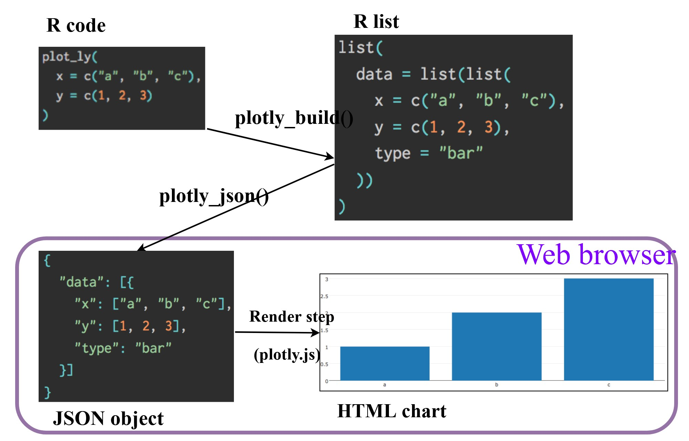

In this third hands-on exercise, we practice programming interactive data visualisation. 

ggiraph and plotlyr packages will be used for this exercise.

## Check, install and launch packages
First, the codes below will be used to check, install and launch the packages needed
```{r}
pacman::p_load(ggiraph, plotly, patchwork, DT, tidyverse)
```
## Importing Data
We will import the data now

```{r}
exam_data <- read_csv("../data/Exam_data.csv", show_col_types = FALSE)
```

## Interactice Data Visualisation - ggiraph
ggiraph is an htmlwidget and an extension of ggplot2.This package allows to make ggplot interactive. Interactive is made with ggplot geometries that can understand three arguments:

1. **tooltip**: a dataset column that provides text to display when the user hovers over chart elements

2. **onclick** : a dataset column that specifies a JavaScript function to run when elements are clicked

3. **data_id**: a dataset column that assigns unique identifiers to elements, enabling selection and linking

When used inside a Shiny application, elements tagged with data_id acn be dynamically selected and manipulated on both the client an server sides.

### Tooltip effect with tooltip aesthetic
The example below illustrated how to build an interactive statistical plot using the ggiraph package. The workflow has two main steps:

1. First, create a standard **ggplot** object.

2. Then, wrap that plot with `girafe()` from ggiraph to produce an interactive svg graphic.

```{r}
p <- ggplot(data=exam_data, 
            aes(x= MATHS)) + 
  geom_dotplot_interactive(
    aes(tooltip = ID),
    stackgroups = TRUE,
    binwidth = 1,
    method = "histodot") +
  scale_y_continuous(NULL,
                      breaks = NULL)
```
This process involves two steps. First, we use an interactive version of a ggplot2 geometry (for example, `geom_dotplot_interactive()`) to build the base chart. Second, wrap the plot with `girafe()` from ggiraph to produce an interactive svg object that can be displayed on an html page.

## Interactivity
By hovering the mouse over a specific data point, the corresponding student ID will appear. 
```{r}
girafe(
  ggobj = p,
  width_svg = 6,
  height_svg = 6*0.618
)
```
### Displaying multiple information on tooltip
The tooltip content can be customized by creating a new field, as shown in the code example below
```{r}
exam_data$tooltip <- c(paste0(
  "Name = ", exam_data$ID,
  "\n Class = ", exam_data$CLASS))
p <- ggplot(data=exam_data,
            aes(x=MATHS)) +
  geom_dotplot_interactive(
    aes(tooltip = exam_data$tooltip),
    stackgroups = TRUE,
    binwidth = 1,
    method = "histodot") +
  scale_y_continuous(NULL,
                     breaks = NULL)
```
In the first few lines of the code chunk, a new variable called `tooltip` is created. This variable combines text from the ID and CLASS columns into a single field. Later in the code, this newly defined `tooltip` field is used as the aesthetic for displaying tooltips in the plot.

## Interactivity
By hovering the mouse over a specific data point, the corresponding student ID will appear. 
```{r}
girafe(
  ggobj = p,
  width_svg = 8,
  height_svg = 8*0.618
)
```
### Customising Tooltip Style
The code chunk below uses `opts_tooltip()` of ggiraph to customize tooltip rendering by add css declarations.
```{r}
tooltip_css <- "background-color:white; #<<
font-style:bold; color:black;" #<<

p <- ggplot(data=exam_data,
            aes(x = MATHS)) +
  geom_dotplot_interactive(
    aes(tooltip = ID),
    stackgroups = TRUE,
    binwidth = 1,
    method = "histodot") +
  scale_y_continuous(NULL, 
                     breaks = NULL)
```
The tooltip is styled with a black background, while the text appears in bold white font.
```{r}
girafe(
  ggobj = p, 
  width_svg = 6,
  height_svg = 6*0.618,
  options = list(
    opts_tooltip(
      css = tooltip_css))
)
```
Refer to [Customizing girafe objects](https://davidgohel.github.io/ggiraph/articles/girafe.html) to learn more about how to customise ggiraph objects.

### Displaying statistics on tooltip
The following code chunk demonstrates a more advanced way to customize tooltips. In this case, a function is applied to calculate the 90% confidence interval of the mean. The resulting statistics are then incorporated into the tooptil display.
```{r}
tooltip <- function(y, ymax, accuracy = 0.01) {
  mean <- scales::number(y, accuracy = accuracy)
  sem <- scales:: number(ymax - y, accuracy = accuracy)
  paste("Mean maths scores:", mean, "+/-", sem)
}

gg_point <- ggplot(data=exam_data, 
                   aes(x = RACE), 
) +
  stat_summary(aes(y = MATHS,
                   tooltip = after_stat(
                     tooltip(y, ymax))),
    fun.data = "mean_se",
    geom = GeomInteractiveCol,
    fill = "light pink"
  ) +
  stat_summary(aes(y = MATHS),
    fun.data = mean_se,
    geom = "errorbar", width = 0.2, size = 0.2
  )
girafe(ggobj = gg_point,
       width_svg = 8,
       height_svg = 8*0.618)
```
This bar chart compares average MATHS scores across four racial groups. The error bars suggest that while there's some variation within each group, the Chinese group consistently scores higher, and the Malay group tends to score lower. 

### Hover effect with data_id aesthetic
The following code chunk demonstrates the second interactive feature available in ggiraph, which is data_id.
```{r}
p <- ggplot(data=exam_data,
            aes(x = MATHS)) +
  geom_dotplot_interactive(
    aes(data_id = CLASS),
    stackgroups = TRUE,
    binwidth = 1,
    method = "histodot") +
  scale_y_continuous(NULL,
                     breaks = NULL)
girafe(
  ggobj = p,
  width_svg = 6,
  height_svg = 6*0.618
)
```
Interactivity: When elements are linked to a data_id, such as CLASS, they become highlighted whenever the mouse pointer hovers over them. The default value of the hover css is hover_css = "fill:orange;"

We will try modifying the color into pink.
```{r}
girafe(                                  
  ggobj = p,                             
  width_svg = 6,                         
  height_svg = 6*0.618,
  options = list(
    opts_hover(css = "fill:pink;")
  )
)   
```

### Styling hover effect
In the following code chunk, css codes are used to change the highlighting effect
```{r}
p <- ggplot(data=exam_data,
            aes(x = MATHS)) +
  geom_dotplot_interactive(
    aes( data_id = CLASS),
    stackgroups = TRUE,
    binwidth = 1,
    method = "histodot") +
  scale_y_continuous(NULL,
                     breaks = NULL)
girafe(
  ggobj = p,
  width_svg = 6, 
  height_svg = 6*0.618,
  options = list(
    opts_hover(css = "fill: #202020;"),
    opts_hover_inv(css = "opacity: 0.2;")
  )
)
```

Interactivity: Elements associated with a data_id, such as CLASS, will be highlighted upon mouse over.

### Combining tooltip and hover effect
The chunk demonstrates how to combine two interactive features in ggiraph: tooltips and hover effects. In this example, tooltips display additional information when the cursor hovers over a point, while the hover effect highlights elements associated with a data_id.
```{r}
p <- ggplot(data=exam_data, 
       aes(x = MATHS)) +
  geom_dotplot_interactive(              
    aes(tooltip = CLASS, 
        data_id = CLASS),              
    stackgroups = TRUE,                  
    binwidth = 1,                        
    method = "histodot") +               
  scale_y_continuous(NULL,               
                     breaks = NULL)
```
Interactivity: When elements are linked to a data_id, such as CLASS, they are highlighted as the mouse hovers over them, while the tooltip simultaneously displays the corresponding CLASS value.
```{r}
girafe(
  ggobj = p,
  width_svg = 6,
  height_svg = 6*0.618,
  options = list(
    opts_hover(css = "fill: #202020;"),
    opts_hover_inv(css = "opacity:0.2;")
  )
)
```

### Click effect with onclick
`onclick` argument of ggiraph provides hyperlink interactivity on the web. A code example is provided below:
```{r}
exam_data$onclick <- sprintf("window.open(\"%s%s\")",
"https://www.moe.gov.sg/schoolfinder?journey=Primary%20school",
as.character(exam_data$ID))

p <- ggplot(data=exam_data, 
       aes(x = MATHS)) +
  geom_dotplot_interactive(              
    aes(onclick = onclick),              
    stackgroups = TRUE,                  
    binwidth = 1,                        
    method = "histodot") +               
  scale_y_continuous(NULL,               
                     breaks = NULL)
girafe(
  ggobj = p,
  width_svg = 6,
  height_svg = 6*0.618)
```
Interactivity: When a data object is linked to a web document, clicking on the element will open that document in the browser.

### Coordinated Multiple Views with ggiraph
The code below creates a multiple views visualisation.
```{r}
p1 <- ggplot(data=exam_data,
             aes(x = MATHS)) +
  geom_dotplot_interactive(
    aes(data_id = ID),
    stackgroups = TRUE,
    binwidth = 1,
    method = "histodot") +
  coord_cartesian(xlim=c(0,100)) +
  scale_y_continuous(NULL,
                     breaks = NULL)
p2 <- ggplot(data=exam_data,
             aes(x = ENGLISH)) + 
  geom_dotplot_interactive(
    aes(data_id = ID),
    stackgroups = TRUE,
    binwidth = 1,
    method = "histodot") +
  coord_cartesian(xlim=c(0,100)) +
  scale_y_continuous(NULL,
                     breaks = NULL)
girafe(code = print(p1+p2),
       width_svg = 6,
       height_svg = 3,
       options = list(
         opts_hover(css = "fill: #202020;"),
         opts_hover_inv(css = "opacity:0.2;")
      )
    )
```
The data_id aesthetic is essential for linking observations across plots, while the tooltip aesthetic is optional but provides useful information when hovering over a point.

When a data point in one dotplot is selected, the corresponding observation in the second visualization is highlighted as well, ENGLISH in this case.
To build these coordinates multiple views, the programming strategy applied is to use the appropriate interactive functions gfrom ggiraph to generate the linked views. Then, employ the `patchwork` function from the patchwork package inside `girafe()` to arrange and render the interactive coordinated plots.

## Interactive Data Visualisation - plotly methods
Plotly's R library enables the creation of interactive web graphics, either by converting ggplot2 charts or by using its own interface to the MIT‑licensed JavaScript library plotly.js, which is built on the grammar of graphics. Unlike other Plotly platforms, plotly for R is completely free and open source.


There are two ways to create interactive graph by using plotly which are plot_ly() and ggplotly()

### Creating an interactive scetterplot using plot_ly() method
The tabset below shows an example of a basic interactive plot created by using `plot_ly()`.

::: {.panel-tabset}

### The plot
```{r,echo=FALSE}
plot_ly(data = exam_data,
        x = ~MATHS,
        y = ~ENGLISH,
        type = "scatter",
        mode = "markers")
```
### The code chunk
```r
plot_ly(data = exam_data,
        x = ~MATHS,
        y = ~ENGLISH,
        type = "scatter",
        mode = "markers")
```
:::
### Working with visual variable using plot_ly() method
In the code chunk below, the color argument is mapped to a qualitative variable specifically, RACE.

::: {.panel-tabset}

### The plot
```{r,echo=FALSE}
plot_ly(data = exam_data, 
        x = ~ENGLISH, 
        y = ~MATHS, 
        color = ~RACE)
```
Interactive: click on the color symbol at the legend

### The code chunk
```r
plot_ly(data = exam_data, 
        x = ~ENGLISH, 
        y = ~MATHS, 
        color = ~RACE)
```
:::
### Creating an interactive scatterplot using ggplotly() method

The code chunk belows displays a plot by using ggplotly().

::: {.panel-tabset}

### The plot
```{r,echo=FALSE}
p <- ggplot(data=exam_data, 
            aes(x = MATHS,
                y = ENGLISH)) +
  geom_point(size=1) +
  coord_cartesian(xlim=c(0,100),
                  ylim=c(0,100))
ggplotly(p)
```

### The code chunk
```r
p <- ggplot(data=exam_data, 
            aes(x = MATHS,
                y = ENGLISH)) +
  geom_point(size=1) +
  coord_cartesian(xlim=c(0,100),
                  ylim=c(0,100))
ggplotly(p)
```
In this code, `ggplotly()` is added as compared to to using the `plotly()` method

:::

### Coordinated Multiple Views using plotly() method
Building a coordinated linked plot in plotly can be broken down into three main steps:

1. Use `highlight_key()` from the plotly package to define the shared data.

2. Create two scatterplots with `ggplot2` functions.

3. Finally, arrange them side‑by‑side using `subplot()` from the plotly package.

::: {.panel-tabset}

### The plot
```{r,echo=FALSE}
d <- highlight_key(exam_data)
p1 <- ggplot(data=d, 
            aes(x = MATHS,
                y = ENGLISH)) +
  geom_point(size=1) +
  coord_cartesian(xlim=c(0,100),
                  ylim=c(0,100))

p2 <- ggplot(data=d, 
            aes(x = MATHS,
                y = SCIENCE)) +
  geom_point(size=1) +
  coord_cartesian(xlim=c(0,100),
                  ylim=c(0,100))
subplot(ggplotly(p1),
        ggplotly(p2))
```
Clicking on a point in one scatterplot automatically selects and highlights the corresponding point in the other scatterplot.

### The code chunk
```r
d <- highlight_key(exam_data)
p1 <- ggplot(data=d, 
            aes(x = MATHS,
                y = ENGLISH)) +
  geom_point(size=1) +
  coord_cartesian(xlim=c(0,100),
                  ylim=c(0,100))

p2 <- ggplot(data=d, 
            aes(x = MATHS,
                y = SCIENCE)) +
  geom_point(size=1) +
  coord_cartesian(xlim=c(0,100),
                  ylim=c(0,100))
subplot(ggplotly(p1),
        ggplotly(p2))
```
:::
The function highlight_key() generates an object of class crosstalk::SharedData.
For more details on how crosstalk works, you can explore its documentation.

## Interactive data visualization using Crosstalk Methods
Crosstalk is an extension of the htmlwidgets framework. It provides classes, functions, and conventions that enable cross‑widget interactions, such as linked brushing and filtering.

### Interactive data table using DT Package
The DT package is a wrapper around the JavaScript library DataTables.
With DT, R data objects can be rendered as interactive HTML tables, typically within R Markdown or Shiny applications.
```{r}
DT::datatable(exam_data, class= "compact")
```

### Linked brushing using Crosstalk Method

::: {.panel-tabset}

### The plot
```{r,echo=FALSE}
d <- highlight_key(exam_data) 
p <- ggplot(d, 
            aes(ENGLISH, 
                MATHS)) + 
  geom_point(size=1) +
  coord_cartesian(xlim=c(0,100),
                  ylim=c(0,100))

gg <- highlight(ggplotly(p),        
                "plotly_selected")  

crosstalk::bscols(gg,               
                  DT::datatable(d), 
                  widths = 5)        
```

### The code chunk

```r
d <- highlight_key(exam_data) 
p <- ggplot(d, 
            aes(ENGLISH, 
                MATHS)) + 
  geom_point(size=1) +
  coord_cartesian(xlim=c(0,100),
                  ylim=c(0,100))

gg <- highlight(ggplotly(p),        
                "plotly_selected")  

crosstalk::bscols(gg,               
                  DT::datatable(d), 
                  widths = 5)        
```
Key takeaway from this method:

1. The highlight() function from the plotly package configures options for brushing (highlighting) across multiple plots. These options are mainly intended for linking multiple Plotly graphs, and behavior may vary when linking Plotly with other htmlwidget packages via crosstalk. In some cases, other widgets (e.g., leaflet) will respect these settings, such as persistent selection.

2. The bscols() helper from the crosstalk package makes it easy to arrange HTML elements side by side. While it can be called directly from the console, it is especially useful in R Markdown documents. Note that using bscols() will load all of Bootstrap.
:::
