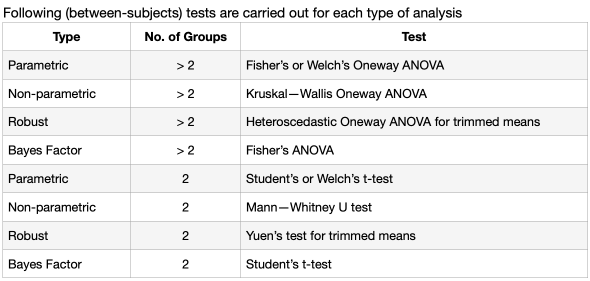
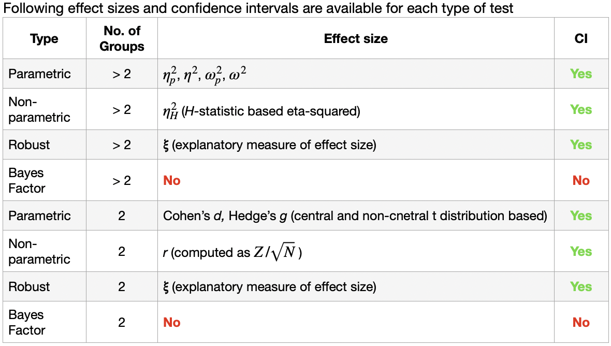
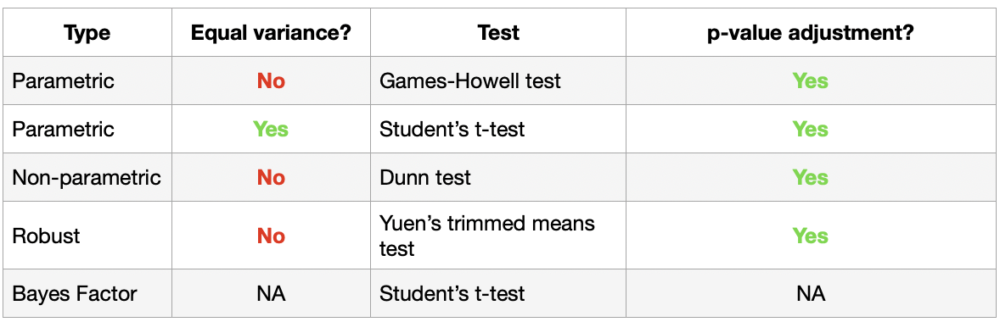

## Visualizing Distribution

Exploring how data is distributed has long been a core part of statistical analysis. In hands-on exercise 1, we introduced several classic visualization techniques such as histograms, probability density curves, boxplots, notch plots, and violin plots and demonstrated how they can be created with ggplot2.

In this chapter, we turn to two more recent visualization methods for examining distributions: the ridgeline plot and the raincloud plot, both of which can be produced using ggplot2 together with its extensions.

## Getting started

### Check, install and launch packages

```{r}
pacman::p_load(ggdist, ggridges, ggthemes, colorspace, tidyverse)
```

The packages above are explained below:

1.  **ggridges**: A ggplot2 extension designed specifically for creating ridgeline plots.

2.  **ggdist**: A ggplot2 extension focused on visualizing distributions and uncertainty.

3.  **tidyverse**: A collection of modern R packages built to support data science workflows and effective visual communication.

4.  **ggthemes**: An extension of ggplot2 that provides additional themes, scales, and geoms to enhance plot styling.

5.  **colorspace**: An R package offering a comprehensive toolbox for selecting and manipulating colors or palettes, making it easier to apply them across different types of visualizations.

### Importing Data

```{r}
exam_data <- read_csv("../data/Exam_data.csv", show_col_types = FALSE)
```

## Visualizing Distribution with Ridgeline Plot

A ridgeline plot (also known as a Joyplot) is a visualization technique used to display the *distribution of a numeric variable across multiple groups*. These distributions can be shown as histograms or density curves, all aligned to a common horizontal axis and slightly overlapping to highlight differences between groups.

Ridgeline plots are most effective when you need to display distributions across a *medium to large number of groups*. In such cases, traditional side‑by‑side plots would consume too much space, whereas the overlapping layout of ridgelines makes more efficient use of the plotting area.

For datasets with *fewer than five groups*, other distribution plots (such as boxplots or violin plots) are usually clearer. Ridgeline plots also work best when there is a *distinct pattern or ranking* among groups. Without such structure, the overlapping curves can create *visual clutter,* making the plot harder to interpret and less insightful.

### Plotting Ridgeline Graph using ggridges method.

The ggridges package provides two primary geoms for creating ridgeline plots:

*geom_ridgeline()*: draws ridgelines directly from supplied height values.

*geom_density_ridges()*: first estimates the data's density and then uses those values to construct ridgelines.

We will try using the `geom_density_ridges()`

::: panel-tabset
### The plot

```{r,echo=FALSE}
ggplot(exam_data,
       aes(x = ENGLISH,
           y = CLASS)) +
  geom_density_ridges(
    scale = 3,
    rel_min_height = 0.01,
    bandwidth = 3.4,
    fill = lighten("#f28fa3", 0.3),
    color = "white"
  ) +
  scale_x_continuous(
    name = "English Grades",
    expand = c(0,0)
    ) +
  scale_y_discrete(name = NULL, expand = expansion(add = c(0.2,2.6))) +
  theme_ridges()
```

Each pink ridge represents the distribution of English grades for a different class, showing how scores vary across groups. Classes 3A and 3C have higher grade concentrations toward the upper end, while class 3I and 3H show broader spreads with lower average grades.

### The code chunk

``` r
ggplot(exam_data,
       aes(x = ENGLISH,
           y = CLASS)) +
  geom_density_ridges(
    scale = 3,
    rel_min_height = 0.01,
    bandwidth = 3.4,
    fill = lighten("#f28fa3", 0.3),
    color = "white"
  ) +
  scale_x_continuous(
    name = "English Grades",
    expand = c(0,0)
    ) +
  scale_y_discrete(name = NULL, expand = expansion(add = c(0.2,2.6))) +
  theme_ridges()
```
:::

### Varying fill colors along the x-axis

Sometimes, instead of filling the area beneath a ridgeline with a single solid color, we may want the fill to vary along the x‑axis. This effect can be achieved using `geom_ridgeline_gradient()` or `geom_density_ridges_gradient()`. These geoms function like `geom_ridgeline()` and `geom_density_ridges()`, but they allow for changing fill colors across the plot.

One limitation is that they do not support alpha transparency in the fill. For technical reasons, we can either apply varying colors or transparency, but not both simultaneously.

::: panel-tabset
### The plot

```{r,echo=FALSE}
ggplot(exam_data,
       aes(x = ENGLISH,
           y = CLASS,
           fill = after_stat(x))) +
  geom_density_ridges_gradient(
    scale = 3,
    rel_min_height = 0.01) +
  scale_fill_viridis_c(name = "Temp. [F]", option = "C") +
  scale_x_continuous(
    name = "English Grades",
    expand = c(0,0)
    ) +
  scale_y_discrete(name = NULL, expand = expansion(add = c(0.2,2.6))) +
  theme_ridges()
```

The color gradient from purple to yellow represents temperature values in °F, depicts how grade distributions vary.

### The code chunk

``` r
ggplot(exam_data,
       aes(x = ENGLISH,
           y = CLASS,
           fill = after_stat(x))) +
  geom_density_ridges_gradient(
    scale = 3,
    rel_min_height = 0.01) +
  scale_fill_viridis_c(name = "Temp. [F]", option = "C") +
  scale_x_continuous(
    name = "English Grades",
    expand = c(0,0)
    ) +
  scale_y_discrete(name = NULL, expand = expansion(add = c(0.2,2.6))) +
  theme_ridges()
```
:::

### Mapping the probabilities directly onto color

Beyond offering additional geom objects for ridgeline plots, the ggridges package also introduces a statistical transformation called `stat_density_ridges()`, which serves as a replacement for ggplot2's standard `stat_density()`.

The figure below demonstrates this approach by mapping probabilities calculated with `stat(ecdf)`, representing the empirical cumulative distribution function (ECDF) of English scores. This allows the ridgeline plot to display cumulative probabilities rather than raw densities, giving a different perspective on the distribution.

::: panel-tabset
### The plot

```{r, echo = FALSE}
ggplot(exam_data,
       aes(x = ENGLISH,
           y = CLASS,
           fill = 0.5 - abs(0.5-stat(ecdf)))) +
  stat_density_ridges(geom = "density_ridges_gradient",
                      calc_ecdf = TRUE) +
  scale_fill_viridis_c(name = "Tail probability",
                       direction = -1) +
  theme_ridges()
```

The color gradient from yellow to dark purple represents tail probability, showing how likely extreme scores are within each class. Darker areas indicate lower probabilities at the distribution tails.

### The code chunk

``` r
ggplot(exam_data,
       aes(x = ENGLISH,
           y = CLASS,
           fill = 0.5 - abs(0.5-stat(ecdf)))) +
  stat_density_ridges(geom = "density_ridges_gradient",
                      calc_ecdf = TRUE) +
  scale_fill_viridis_c(name = "Tail probability",
                       direction = -1) +
  theme_ridges()
```

When using `stat_density_ridges()`, it is important to include the argument `calc_ecdf = TRUE`. This ensures that the function computes the empirical cumulative distribution function (ECDF) for the data, allowing the ridgeline plot to represent cumulative probabilities rather than just densities. Without this argument, the plot will not display the ecdf correctly.

Setting `direction = -1` flips the color scale, so the colors are mapped in the opposite way
:::

### Ridgeline plots with quantile lines

Using `geom_density_ridges_gradient()`, ridgeline plots can be colored according to quantiles by mapping the aesthetic `stat(quantile)`. This approach highlights different portions of the distribution with distinct colors, making it easier to see how values fall into quantile ranges.

The figure below demonstrates this technique, where the ridgelines are shaded by quantile rather than a single uniform fill.

::: panel-tabset
### The plot

```{r, echo = FALSE}
ggplot(exam_data,
       aes(x = ENGLISH,
           y = CLASS,
           fill = factor(stat(quantile)))) +
  stat_density_ridges(geom = "density_ridges_gradient",
                      calc_ecdf = TRUE,
                      quantiles = 4,
                      quantile_lines = TRUE) +
  scale_fill_viridis_d(name = "Quartiles") +
  theme_ridges()
```

Each curve is divided into quartiles, colored from dark purple (lowest scores) to yellow (highest), showing how student performance varies within and across classes.

### The code chunk

``` r
ggplot(exam_data,
       aes(x = ENGLISH,
           y = CLASS,
           fill = factor(stat(quantile)))) +
  stat_density_ridges(geom = "density_ridges_gradient",
                      calc_ecdf = TRUE,
                      quantiles = 4,
                      quantile_lines = TRUE) +
  scale_fill_viridis_d(name = "Quartiles") +
  theme_ridges()
```
:::

Instead of defining quantiles by number, we can also set them using cut points. For example, the 2.5% and 97.5% tails to color the ridgeline plot, as shown in the figure below.

::: panel-tabset
### The plot

```{r, echo = FALSE}
ggplot(exam_data,
       aes(x = ENGLISH,
           y = CLASS,
           fill = factor(stat(quantile)))) +
  stat_density_ridges(geom = "density_ridges_gradient",
                      calc_ecdf = TRUE,
                      quantiles = c(0.025, 0.975)) +
  scale_fill_manual(
    name = "Probability",
    values = c("#FF0000A0", "#A0A0A0A0", "#0000FFA0"),
    labels = c("(0, 0.025]", "(0.025, 0.975]", "(0.975, 1]")
  ) + 
  theme_ridges()
```

The shaded regions represent probability intervals---red for the lower tail (0--2.5%), gray for the central range (2.5--97.5%), and blue for the upper tail (97.5--100%). This highlights how each class' scores spread and where extreme values occur within their distributions.

### The code chunk

``` r
ggplot(exam_data,
       aes(x = ENGLISH,
           y = CLASS,
           fill = factor(stat(quantile)))) +
  stat_density_ridges(geom = "density_ridges_gradient",
                      calc_ecdf = TRUE,
                      quantiles = c(0.025, 0.975)) +
  scale_fill_manual(
    name = "Probability",
    values = c("#FF0000A0", "#A0A0A0A0", "#0000FFA0"),
    labels = c("(0, 0.025]", "(0.025, 0.975]", "(0.975, 1]")
  ) + 
  theme_ridges()
```

The `stat_density_ridges` chunk draws ridgelines with gradient fill, computes ecdf and marks the 2.5% and 97.5% quantile cut points. Then the `scale_fill_manual` chunk define custom colors and legends for the three quantile ranges.
:::

## Visualizing Distribution with Raincloud Plot

A raincloud plot is a visualization technique that combines a half‑density curve with a distribution plot. Its name comes from the density curve's resemblance to a *raincloud*. Unlike a traditional boxplot, which does not reveal where values cluster, the raincloud plot highlights multiple modes in the data, making it easier to detect potential groupings.

In this section, we will learn how to create a raincloud plot to show the distribution of English scores by race, using functions from the `ggdist` and `ggplot2` packages.

### Plotting a Half Eye Graph

We will plot a Half Eye graph using `stat_halfeye()` from the `ggdist` package.

::: panel-tabset
### The plot

```{r, echo = FALSE}
ggplot(exam_data,
       aes( x = RACE,
            y = ENGLISH)) +
  stat_halfeye(adjust = 0.5,
               justification = -0.2,
               .width = 0,
               point_color = NA)
```

This half‑eye plot shows the distribution of English scores across four racial groups. Each gray half‑density curve represents how scores are spread within a group, with wider sections indicating where scores are more concentrated and narrower parts showing less frequent values.

### The code chunk

``` r
ggplot(exam_data,
       aes( x = RACE,
            y = ENGLISH)) +
  stat_halfeye(adjust = 0.5,
               justification = -0.2,
               .width = 0,
               point_color = NA)
```

-   `adjust` controls the smoothness of the density estimate.

-   `justification` shifts the half-eye slightly to avoid overlap with the boxplot or points.

-   `.width` disables inter bands meaning only the density curve is shown.

-   `point_color` removes individual data points from the plot.
:::

### Adding the boxplot using geom_boxplot()

We will add the second geometry layer using `geom_boxplot()` from `ggplot2`.

::: panel-tabset
### The plot

```{r, echo = FALSE}
ggplot(exam_data,
       aes( x = RACE,
            y = ENGLISH)) +
  stat_halfeye(adjust = 0.5,
               justification = -0.2,
               .width = 0,
               point_color = NA) +
   geom_boxplot(width = 0.20, 
                outlier.shape = NA)
```

These boxplots show the median, interquartile range, and whiskers for English scores. It provides a clear summary of central tendency and spread, also the full distribution shape.

### The code chunk

``` r
ggplot(exam_data,
       aes( x = RACE,
            y = ENGLISH)) +
  stat_halfeye(adjust = 0.5,
               justification = -0.2,
               .width = 0,
               point_color = NA) +
  geom_boxplot(width = 0.20,
  outlier.shape = NA)
```

-   `width` makes the boxplot narrow so it doesn't dominate the density shape.

-   `outlier.shape` controls how outliers are displayed. NA in this case removes all outliers so they won't be plotted.

Another setting that we can include in the geom_boxplot is `alpha` where it sets the opacity of the boxplot.
:::

### Adding the Dot Plots using stat_dots()

Next, we will add the third geometry layer using `stat_dots()`. This function creates a half-dotplot, which works like a histogram by showing the number of samples in dots in each bin.

::: panel-tabset
### The plot

```{r, echo = FALSE}
ggplot(exam_data,
       aes( x = RACE,
            y = ENGLISH)) +
  stat_halfeye(adjust = 0.5,
               justification = -0.2,
               .width = 0,
               point_color = NA) +
   geom_boxplot(width = 0.20, 
                outlier.shape = NA) +
  stat_dots(side = "left",
            justification = 1.2,
            binwidth = 0.5,
            dotsize = 2)
```

The dots represent individual English scores, giving a clear view of data density, outliers, and summary statistics. \### The code chunk

``` r
ggplot(exam_data,
       aes( x = RACE,
            y = ENGLISH)) +
  stat_halfeye(adjust = 0.5,
               justification = -0.2,
               .width = 0,
               point_color = NA) +
   geom_boxplot(width = 0.20, 
                outlier.shape = NA) +
  stat_dots(side = "left",
            justification = 1.2,
            binwidth = 0.5,
            dotsize = 2)
```

-   `side = left` instructs that we want it on the left-hand side of the boxplot.
:::

### Finishing touch

The `coord_flip()` flips the aces so the raincloud plot is displayed horizontally. This orientiation gives the plot its characteristic raincloud appearance, with the density curve above the boxplot. The `theme_economist()` applies a style from the `ggthemes` package.

::: panel-tabset
### The plot

```{r, echo=FALSE}
ggplot(exam_data,
       aes( x = RACE,
            y = ENGLISH)) +
  stat_halfeye(adjust = 0.5,
               justification = -0.2,
               .width = 0,
               point_color = NA) +
   geom_boxplot(width = 0.20, 
                outlier.shape = NA) +
  stat_dots(side = "left",
            justification = 1.2,
            binwidth = 0.5,
            dotsize = 1.5) +
  coord_flip() +
  theme_economist()
```

This final plot combines the previous plots into a single plot that highlights each group's characteristics.

### The code chunk

``` r
ggplot(exam_data,
       aes( x = RACE,
            y = ENGLISH)) +
  stat_halfeye(adjust = 0.5,
               justification = -0.2,
               .width = 0,
               point_color = NA) +
   geom_boxplot(width = 0.20, 
                outlier.shape = NA) +
  stat_dots(side = "left",
            justification = 1.2,
            binwidth = 0.5,
            dotsize = 1.5) +
  coord_flip() +
  theme_economist()
```
:::

## Visual Statistical Analysis

In this section, we will practice using three packages for enhanced statistical visualization:

1.  ggstatsplot: to create plots enriched with statistical details.

2.  performance: to visualize model diagnostics.

3.  parameters: to display and interpret model parameters.

Together, these tools provide a comprehensive way to explore data, assess models, and present results clearly.

### Visual Statistical Analysis using ggstatsplot()

The `ggstatsplot()` package extends `ggplot2` by including results from statistical tests directly into plots, making them more informative. It provides alternative inference methods by default like robust tests. Moreover, it also follows best practices for statistical reporting, with outputs formatted according to the APA gold standard.

For example, a robust t‑test result is automatically displayed in the plot with proper APA style notation. 

## Getting started

### Check, install and launch packages

`ggstatsplot` and `tidyverse` will be used for this section exercise

```{r}
pacman:: p_load(ggstatsplot,tidyverse)
```

### One-sample test using gghistostats() method

We will use a visual of one-sample t-test on English scores using the `gghistostats()` function

::: panel-tabset
### The plot

```{r, echo = FALSE}
set.seed(1234)

gghistostats(
  data = exam_data,
  x = ENGLISH,
  type = "bayes",
  test.value = 60,
  xlab = "English scores"
)
```

This histogram shows the distribution of English scores with most values clustering between roughly 50 and 85. The blue dashed line marks the estimated mean score.

### The code chunk

``` r
set.seed(1234)

gghistostats(
  data = exam_data,
  x = ENGLISH,
  type = "bayes",
  test.value = 60,
  xlab = "English scores"
)
```

`set.seed()` fixes the random seed so results are reproducible which is important for Bayesian sampling.

`gghistostats()` creates a histogram with statistical results.

`type` specifies a Bayesian one-sample test.

`test.value` compares the sample mean of English scores against the reference value.

`xlab` labels the x-axis as English scores for clarity.

By default, it provides statistical details, Bayes Factor, sample size and distribution summary.
:::

### Unpacking the Bayes Factor

-   A **Bayes factor** compares how likely the data are under one hypothesis versus another. It serves as a measure of the strength of evidence supporting one theory over its competitor.

-   This works because the Bayes factor allows us to evaluate evidence for the null hypothesis while incorporating prior information. In essence, it shows the weight of evidence favoring a particular hypothesis.

-   When testing two competing hypotheses, H₁ (the alternative) and H₀ (the null), the Bayes factor is often written as B₁₀, and is defined mathematically as the ratio of their likelihoods. A picture below is the mathematical formula  The Schwarz criterion (also known as the Bayesian Information Criterion, BIC) provides a straightforward way to approximate the Bayes Factor.

### How to intepret Bayes Factor

A Bayes Factor can take any positive value. One widely used interpretation comes from Harold Jeffreys (1961), later refined by Lee and Wagenmakers (2013). Their framework provides a scale for judging the strength of evidence, where different ranges of Bayes Factor values correspond to varying levels of support for one hypothesis over another. 

### Two-sample mean test using ggbetweenstats() method

We will use a visual of two-sample mean test on Math scores by gender using the `ggbetweenstats()` function

```{r}
ggbetweenstats(
  data = exam_data,
  x = GENDER,
  y = MATHS,
  type ="np",
  messages = FALSE
)
```

`x,y` sets GENDER as the grouping variable ans MATHS scores as the outcome.

`type` chooses a non-parametric test due to assumptions of non-normality.

`messages` false means it suppresses extra messages/warnings from the statistical test output.

**Interpretation**: This plot compares maths score distributions between female and male students. Each violin shows the spread of scores with boxplots, individual data points,and summary statistics.

### Oneway ANOVA Test using ggbetweenstats() method

We will use a visual for Oneway ANOVA test on English scores by race using the `ggbetweenstats()` function

```{r}
ggbetweenstats(
  data = exam_data,
  x = RACE,
  y = ENGLISH,
  type ="p",
  mean.ci = TRUE,
  pairwise_comparisons = TRUE,
  pairwise.display = "s",
  p.adjust.method = "fdr",
  messages = FALSE
)
```

`type` chooses a parametric test for group comparison.

`mean.ci` TRUE displays confidence intervals around group means in the plot.

`pairwise_comparisons` TRUE run pairwise tests between groups.

`pairwise.display` "s" shows significance markers for pairwise comparisons directly on the plot. "ns" shows only non-significant and "all" shows everything.

`p.adjust.method` adjusts p-values using the false discovery rate method to control for multiple comparisons.

**Interpretation**: This plot compares English score distributions across racial groups. The statistical results above show a significant difference among groups (Welch's F = 10.15,p ≈ 1.7 × 10⁻⁴), with Chinese and Others having higher mean scores than Indian and Malay, while the Bayesian metrics above confirm strong evidence supporting these group differences.

#### Summary of Tests

 

Summary of **multiple pairwise comparison** tests supported in ggbetweenstats 

### Significant Test of Correlation using ggscatterstats() method

We will use a visual for Significant Test if Correlation between Maths and English scores using the `ggscatterstats()` function

```{r}
ggscatterstats(
  data = exam_data,
  x = MATHS,
  y = ENGLISH,
  marginal = FALSE,
)
```

`marginal` FALSE disables the marginal plots, so only the main scatterplot with statistical results is displayed

**Interpretation**: This scatter plot shows a strong positive relationship between Maths and English scores, with most points clustering along the upward sloping regression line. The correlation coefficient 0.83 and extremely small p‑value statistically confirm that students who perform well in maths tend to also achieve high english scores.

### Significant Test of Association (Dependence) using ggbarstats method

We will use `cut()` to bin the Maths scores inot a 4 class variables

```{r}
exam1 <- exam_data %>%
  mutate(MATHS_bins =
          cut(MATHS,
              breaks = c(0,60,75,85,100))
)
```

Next, `ggbarstats()` is used to build a visual for the test of association

```{r}
ggbarstats(exam1,
           x = MATHS_bins,
           y = GENDER)
```

**Interpretation**: This stacked bar chart compares Maths score distributions across Gender. The statistical results at the top show no significant difference in score proportions between genders, meaning both groups have similar performance patterns across the defined score ranges.

## Visualizing Uncertainty

The use of graphics to represent uncertainty is a relatively recent development in statistical visualization. In this section, we will learn how to:

1.  Draw error bars with ggplot2.

2.  Build interactive error bars by combining ggplot2, plotly, and DT.

3.  Create advanced uncertainty visualizations with ggdist.

4.  Generate hypothetical outcome plots (HOPs) using the ungeviz package.

## Getting started

### Check, install and launch packages

For this section, we will work with several packages:

1.  **tidyverse** is a collection of packages supporting the full data science workflow.

2.  **plotly** is for building interactive plots.

3.  **gganimate** is for creating animated graphics.

4.  **DT** is for rendering interactive HTML tables.

5.  **crosstalk** is to enable cross‑widget interactions such as linked brushing and filtering.

6.  **ggdist** --- for visualizing distributions and uncertainty.

```{r}
pacman:::p_load(plotly, crosstalk, DT, ggdist, ggridges, colorspace, gganimate, tidyverse)
```

### Visualizing the uncertainty of point estimates using ggplot2() methods

A point estimate is a single numerical summary, such as the mean. In contrast, uncertainty is conveyed through measures like the standard error, confidence intervals, or credible intervals.In this section, we will learn how to visualize uncertainty by plotting error bars of Maths scores across racial groups, using the exam tibble data frame.

To begin, the following code chunk will generate the required summary statistics.

```{r}
my_sum <- exam_data %>%
  group_by(RACE) %>%
  summarise(
    n=n(),
    mean=mean(MATHS),
    sd=sd(MATHS)
    ) %>%
  mutate(se=sd/sqrt(n-1))
```

`group_by()` from dplyr is used to organize the data by the variable RACE, so calculations are done within each racial group.

`summarise()` then computes summary statistics for each group: the number of observations, the mean, and the standard deviation of Maths scores.

`mutate()` adds a new column that calculates the standard error of Maths scores for each racial group.

Finally, the results are stored as a tibble called `my_sum`, which holds the grouped summary table.

Next, we will visualize `my_sum` tibble data frame in an html table format

::: panel-tabset
### The table

```{r, echo = FALSE}
knitr::kable(head(my_sum), format = 'html')
```

### The codechunk

``` r
knitr::kable(head(my_sum), format = 'html')
```
:::

### Plotting standard error bars of point estimates

We will plot the standard error bars of mean Maths score by Race using `geom_errorbar()`

::: panel-tabset
### The plot

```{r, echo = FALSE}
ggplot(my_sum) +
  geom_errorbar(
    aes(x = RACE,
        ymin = mean-se,
        ymax = mean+se),
    width = 0.2,
    color = "black",
    alpha = 0.9,
    linewidth = 0.5) +
  geom_point(aes(
    x = RACE, y = mean),
    stat = "identity",
    color = "pink",
    size = 1.5,
    alpha = 1) +
  ggtitle("Standard Error of Mean Maths Score by Race")
```

### The code chunk

``` r
ggplot(my_sum) +
  geom_errorbar(
    aes(x = RACE,
        ymin = mean-se,
        ymax = mean+se),
    width = 0.2,
    color = "black",
    alpha = 0.9,
    linewidth = 0.5) +
  geom_point(aes(
    x = RACE, y = mean),
    stat = "identity",
    color = "pink",
    size = 1.5,
    alpha = 1) +
  ggtitle("Standard Error of Mean Maths Score by Race")
```

**geom_errorbar** section

`aes(x = RACE, ymin = mean-se, ymax = mean+se)` plots bars centered on the group mean, extending one s.e. above and below

`width` controls the horizontal width of the error bar caps

`color` sets the bar color

`alpha` sets the opacity

`linewidth` sets the line thickness

`geom_point()` adds points at the group means

**geom_point** section

`aes(x = RACE, y = mean)` places the mean value for each racial group

`stat` identity uses the actual values provided instead of computed

`color` sets the points color

`size` sets the points size

`ggtitle` adds a title to the plot
:::

### Plotting Confidence Interval of Point Estimates

::: panel-tabset
### The plot

```{r, echo = FALSE}
ggplot(my_sum) +
  geom_errorbar(
    aes(x = reorder(RACE, -mean),
        ymin = mean-1.96*se,
        ymax = mean+1.96*se),
    width = 0.2,
    color = "black",
    alpha = 0.9,
    linewidth = 0.5) +
  geom_point(aes(
    x = RACE, y = mean),
    stat = "identity",
    color = "pink",
    size = 1.5,
    alpha = 1) +
  labs(x = "Maths Score",
      title = "95% CI of Mean Maths Score by Race")
```

### The code chunk

``` r
ggplot(my_sum) +
  geom_errorbar(
    aes(x = reorder(RACE, -mean),
        ymin = mean-1.96*se,
        ymax = mean+1.96*se),
    width = 0.2,
    color = "black",
    alpha = 0.9,
    linewidth = 0.5) +
  geom_point(aes(
    x = RACE, y = mean),
    stat = "identity",
    color = "pink",
    size = 1.5,
    alpha = 1) +
  labs(x = "Maths Score",
      title = "95% CI of Mean Maths Score by Race")
```

`...reorder` groups are reordered by descending mean score, instead of using RACE as its default

`ymin , ymax` plots 95% CI where the upper and lower limit bound formula is (mean ± 1.96 \* se)

`labs()` updates the x-axis label and give title

The rest remains the same as in the earlier standard errors plot code
:::

### Visualizing the uncertainty of point estimates with interactive error bars

We will learn how to plot interactive error bars for the 99% CI of mean Maths score by Race shown below

::: panel-tabset
### The plot

```{r, echo = FALSE}
shared_df = SharedData$new(my_sum)

bscols(widths = c(4,8),
       ggplotly(ggplot(shared_df) +
                  geom_errorbar(aes(
                    x = reorder(RACE, -mean),
                    ymin = mean-2.58*se,
                    ymax = mean+2.58*se),
                    width = 0.2,
                    color = "black",
                    alpha = 0.9,
                    size = 0.5) +
                  geom_point(aes(
                    x = RACE,
                    y = mean,
                    text = paste("Race:", `RACE`,
                                 "<br>N:", `n`,
                                 "<br>Avg. Scores:", round(mean, digits = 2),
                                 round((mean-2.58*se), digits = 2), ",",
                                 round((mean+2.58*se), digits = 2),"]")),
                    stat = "identity",
                    color = "pink",
                    size = 1.5,
                    alpha = 1) +
                  xlab("Race") +
                  ylab("Average Scores") +
                  theme_minimal() +
                  theme(axis.text.x = element_text(
                    angle=45, vjust=0.5, hjust=1)) +
                  ggtitle("99% Confidence Interval of Average /<br>Maths Scores by Race"),
                 tooltip = "text"
      ),
      DT::datatable(shared_df,
                    rownames = FALSE,
                    class = "compact",
                    width = "100%",
                    options = list(pageLength = 10, scrollX=T),
                    colnames = c("No of pupils", "Avg Scores", "Std Dev", "Std error")) %>%
        formatRound(columns=c('mean', 'sd', 'se'), digits =2))
```

### The code chunk

``` r
shared_df = SharedData$new(my_sum)

bscols(widths = c(4,8),
       ggplotly(ggplot(shared_df) +
                  geom_errorbar(aes(
                    x = reorder(RACE, -mean),
                    ymin = mean-2.58*se,
                    ymax = mean+2.58*se),
                    width = 0.2,
                    color = "black",
                    alpha = 0.9,
                    size = 0.5) +
                  geom_point(aes(
                    x = RACE,
                    y = mean,
                    text = paste("Race:", `RACE`,
                                 "<br>N:", `n`,
                                 "<br>Avg. Scores:", round(mean, digits = 2),
                                 round((mean-2.58*se), digits = 2), ",",
                                 round((mean+2.58*se), digits = 2),"]")),
                    stat = "identity",
                    color = "pink",
                    size = 1.5,
                    alpha = 1) +
                  xlab("Race") +
                  ylab("Average Scores") +
                  theme_minimal() +
                  theme(axis.text.x = element_text(
                    angle=45, vjust=0.5, hjust=1)) +
                  ggtitle("99% Confidence Interval of Average /<br>Maths Scores by Race"),
                 tooltip = "text"
      ),
      DT::datatable(shared_df,
                    rownames = FALSE,
                    class = "compact",
                    width = "100%",
                    options = list(pageLength = 10, scrollX=T),
                    colnames = c("No of pupils", "Avg Scores", "Std Dev", "Std error")) %>%
        formatRound(columns=c('mean', 'sd', 'se'), digits =2))
```

Code explanation divided into different chunks:

**Shared data setup**

`shared_df` creates a shared data object from *my_sum*. This allows linking between the plot and the datatable and enhance filtering to be synchronized

**`bscols`** arranges two components side by side

**Interactive plot with ggplotly**

`ggplotly(ggplot())` wraps a ggplot in ggplotly to make it interactive and starts it using the dataset *shared_df*

`geom_errorbar` plots error bars for each racial group

`reorder()` orders groups by descending mean

`ymin , ymax` plots 99% CI where the upper and lower limit bound formula is (mean ± 2.58 \* se)

`text` shows RACE, sample size(n), average scores and CI bounds

`angle` rotates x-axis labels 45° for readability

`tooltip` text ensures the custom tooltip is shown in the interactive plot

**Interactive datatable**

It displays the same data in an interactive HTML table

`rownames` FALSE sets no row names

`class` compact style

`width` 100% sets to full width

`formatRound` rounds numeric columns (mean, sd, se) to 2 decimal places
:::

### Visualizing Uncertainty using ggdist() package

ggdist is an R package that extends ggplot2 with specialized geoms and stats for visualizing distributions and uncertainty. It supports both frequentist and Bayesian approaches, built on the idea that uncertainty can be understood through distribution visualization:

-   In **frequentist models**, we can display confidence distributions or bootstrap distributions (refering to `vignette("freq-uncertainty-vis")`).

-   In **Bayesian models**, we visualize probability distributions, often using the tidybayes package, which builds on top of ggdist. 

### Visualizing the uncertainty of point estimates using stat_pointinterval() method

We will use `stat_pointinterval()` of ggdist to build a visual for displaying distribution of Maths Scores by Race

::: panel-tabset
### The plot

```{r, echo = FALSE}
exam_data %>%
  ggplot(aes(x = RACE,
             y = MATHS)) +
  stat_pointinterval() +
  labs(
    title = "Visualizing Confidence Intervals of Mean Maths Score",
    subtitle = "Mean Point + Multiple-interval Plot"
  )
```

### The code chunk

``` r
exam_data %>%
  ggplot(aes(x = RACE,
             y = MATHS)) +
  stat_pointinterval() +
  labs(
    title = "Visualizing Confidence Intervals of Mean Maths Score",
    subtitle = "Mean Point + Multiple-interval Plot"
  )
```

`%>%` pipes exam data into ggplot()

`stat_pointinterval()` adds a point interval plot, shows the mean point and multiple CI around it. This combines point estimates with uncertainty visualization in one layer
:::

More arguments can be used to modify the plot, such as using `.width`, `.point`, and `.interval`

::: panel-tabset
### The plot

```{r, echo=FALSE}
exam_data %>%
  ggplot(aes(x = RACE,
             y = MATHS)) +
  stat_pointinterval(.width = 0.95,
                     .point = median,
                     .interval = qi) +
  labs(
    title = "Visualizing Confidence Intervals of Mean Maths Score",
    subtitle = "Mean Point + Multiple-interval Plot"
  )
```

### The code chunk

``` r
exam_data %>%
  ggplot(aes(x = RACE,
             y = MATHS)) +
  stat_pointinterval(.width = 0.95,
                     .point = median,
                     .interval = qi) +
  labs(
    title = "Visualizing Confidence Intervals of Mean Maths Score",
    subtitle = "Mean Point + Multiple-interval Plot"
```
:::

### Visualizing the uncertainty of point estimates showing Confidence Intervals

::: panel-tabset
### **95% Confidence Intervals**

```{r}
exam_data %>%
  ggplot(aes(x = RACE,
             y = MATHS)) +
  stat_pointinterval(.width = 0.95,
                     .point = mean,
                     .interval = qi) +
  labs(
    title = "Visualizing Confidence Intervals of Mean Maths Score",
    subtitle = "Mean Point + 95% CI interval Plot")
```

Each black dot marks the sample mean of Maths scores for each RACE. The vertical line is the 95% CI where it shows the range of values that is likely to contain the true popoulation mean 95% of the time.

### **99% Confidence Intervals**

```{r}
exam_data %>%
  ggplot(aes(x = RACE,
             y = MATHS)) +
  stat_pointinterval(.width = 0.99,
                     .point = mean,
                     .interval = qi) +
  labs(
    title = "Visualizing Confidence Intervals of Mean Maths Score",
    subtitle = "Mean Point + 99% CI interval Plot")
```
:::

### Visualizing the uncertainty of point estimates with Mean Point

::: panel-tabset
### The plot

```{r, echo = FALSE}
exam_data %>%
  ggplot(aes(x = RACE, 
             y = MATHS)) +
  stat_pointinterval(
    show.legend = FALSE) +   
  labs(
    title = "Visualising Confidence Intervals of Mean Maths Score",
    subtitle = "Mean Point + Multiple-interval plot")
```

### The code chunk

``` r
exam_data %>%
  ggplot(aes(x = RACE, 
             y = MATHS)) +
  stat_pointinterval(
    show.legend = FALSE) +   
  labs(
    title = "Visualising Confidence Intervals of Mean Maths Score",
    subtitle = "Mean Point + Multiple-interval plot")
```
:::

### Visualizing the uncertainty of point estimates using stat_gradientinterval() method

::: panel-tabset
### The plot

```{r, echo=FALSE}
exam_data %>%
  ggplot(aes(x = RACE, 
             y = MATHS)) +
  stat_gradientinterval(   
    fill = "pink",      
    show.legend = TRUE     
  ) +                        
  labs(
    title = "Visualising Confidence Intervals of Mean Maths Score",
    subtitle = "Gradient + interval plot")
```

### The code chunk

``` r
exam_data %>%
  ggplot(aes(x = RACE, 
             y = MATHS)) +
  stat_gradientinterval(   
    fill = "pink",      
    show.legend = TRUE     
  ) +                        
  labs(
    title = "Visualising Confidence Intervals of Mean Maths Score",
    subtitle = "Gradient + interval plot")
```
:::

## Visualizing uncertainty with Hypothetical Outcome (HOPs)

### Check, install and load package

```{r}
devtools::install_github("wilkelab/ungeviz")
```

```{r}
library(ungeviz)
```

### Building the HOPs

::: panel-tabset
### The plot

```{r, echo = FALSE}
ggplot(data = exam_data,
       (aes(x = factor(RACE),
           y = MATHS))) +
  geom_point(position = position_jitter(
    height = 0.3,
    width = 0.05),
    size = 0.4,
    color = "red",
    alpha = 1/2) +
  geom_hpline(data = sampler(25, group=RACE),
              height = 0.6,
              color = "#D55E00") +
  theme_bw() + transition_states(.draw,1,3)
```

### The code chunk

``` r
ggplot(data = exam_data,
       (aes(x = factor(RACE),
           y = MATHS))) +
  geom_point(position = position_jitter(
    height = 0.3,
    width = 0.05),
    size = 0.4,
    color = "red",
    alpha = 1/2) +
  geom_hpline(data = sampler(25, group=RACE),
              height = 0.6,
              color = "#D55E00") +
  theme_bw() + transition_states(.draw,1,3)
```

Code explanation:

`ggplot` maps RACE converted to a factor (x-axis) against Maths Scores (y-axis)

`geom_point` plots individual student scores as red points.

`position_jitter()` adds small random shifts such as height and width so points don't overlap

`geom_hpline` adds a horizontal line summary for each group

`sampler` generates bootstrap samples of 25 draws per group

`.draw` animates the plot across different bootstrap draws

`transition_length = 1` is the speed of transition between states

`state_length` is how long each state is displayed
:::

## Funnel Plots for Fair Comparisons

A funnel plot is a specialized visualization tool designed to support fair comparisons across outlets, stores, or business units. In this section we will learn how to

-   create funnel plots using the `funnelPlotR` package

-   build static funnel plots with `ggplot2`

-   develop interactive funnel plots by combining `plotly` and `ggplot2`

### Check, install and load packages

```{r}
pacman::p_load(tidyverse, FunnelPlotR, plotly, knitr)
```

`readr` is for importing csv into R

`FunnelPlotR` is for creating a funnel plot

`knitr` is for building static html table

### Importing Data

In this part of the exercise, we will work with the COVID‑19_DKI_Jakarta dataset. The focus is on comparing the cumulative COVID‑19 cases and deaths across sub‑districts (i.e. *kelurahan*) in DKI Jakarta as of 31 July 2021.

The following code chunk imports the dataset into R and stores it as a tibble data frame named covid19.

```{r}
covid19 <- read_csv("../data/COVID-19_DKI_Jakarta.csv") %>% mutate(across(where(is.character), as.factor))
```

We will show the table as an interactive html table by using the `DT` package

```{r}
library(DT)
datatable(covid19)
```

It created a searachable and sortable table.

### FunnelPlotR methods

The FunnelPlotR package builds funnel plots using ggplot2. To generate a plot, we need to provide a *numerator* (events of interest, a *denominator* (the relevant population) and a *grouping variable*. The key customization options include:

-   `limit` sets confidence (95% or 99%)

-   `label_outliers` sets whether outliers are labeled (TRUE/FALSE)

-   `poisson_limits` adds Poisson distributions limits

-   `OD_adjust` applies overdispersion adjustments

-   `xrange` and `yrange` defines axis ranges, functioning like a zoom

-   Other aesthetic components to customize title, axis labels and other visual details

### Creating a basic plot with FunnelPlotR methods

This code chunk displays a funnel plot object with 267 points where there is no outlier. Plot is adjusted overdispersion.

::: panel-tabset
### The plot

```{r}
funnel_plot(
  .data = covid19,
  numerator = Positive,
  denominator = Death,
  group = `Sub-district`
)
```

### Code explanation

`numerator = Positive` defines the number of positive cases

`denominator = Death` defines the number of deaths.

`group` sets the grouping variable as sub-district.

Improvements suggested are adding plot limits, label outliers, adjust for overdispersion, zoom into range, and add titles and or labels

By default data_type = "SR" in FunnelPlotR means the plot is built for indirectly standardised ratios (SR).
:::

### FunnelPlotR data_type Controls

-   "**SR**" is the default data_type argument where it stands for Standardised Ratios. It compares observed events against expected values adjusted for case mix, rather than raw proportions or simple count ratios.

-   "**PR**" stands for Proportions. It uses numerator/denominator directly as a proportion.

-   "**RC**" is Ratios of Counts. It compares raw counts between groups. it may be useful for comparing absolute event counts across units.

#### Makeover 1

We will change our data_type to PR as it is more appropriate in this case. Moreover, we will specify the axis ranges.

```{r}
funnel_plot(
  .data = covid19,
  numerator = Death,
  denominator = Positive,
  group = `Sub-district`,
  data_type = "PR",
  xrange = c(0,6500),
  yrange = c(0, 0.05)
)
```

From the plot above, there is still room for improvement

#### Makeover 2

In the second makeover, we will give a title for the plot and the axis. We will remove the default label outliers feature as shown in the code below.

```{r}
funnel_plot(
  .data = covid19,
  numerator = Death,
  denominator = Positive,
  group = `Sub-district`,
  data_type = "PR",
  xrange = c(0,6500),
  yrange = c(0, 0.05),
  label = NA,
  title = "Cumulative COVID-19 Fatality Rate by Cumulative Total Number of COVID-19 Positive Cases",
  x_label = "Cumulative COVID-19 Positive Cases",
  y_label = "Cumulative Fatality Rate"
)
```

### Funnel Plot for Fair Visual Comparison using ggplot2 methods

In this section, we will construct funnel plots step by step with ggplot2. The goal is to strengthen our ability to customize specialized visualizations such as funnel plots, while deepening our working knowledge of ggplot2.

### Computing the basic derived fields

To build a funnel plot from scratch, we need to calculate two key values for each group.

1.  Cumulative Death Rate - this is the proportion of deaths relative to the population at risk.
2.  Standard Error of Death Rate - the s.e. quantifies uncertainty around the death rate estimate. The formula for binomial standard error for a proportion is `s.e = sqrt((p*(1-p))/n)`

```{r}
df <- covid19 %>%
  mutate(rate = Death/Positive) %>%
  mutate(rate.se = sqrt((rate*(1-rate)) / (Positive))) %>%
  filter(rate > 0)
```

`filter(rate>0)` keeps only rows where the death rate is greater than zero.

Next, *fit.mean* is computed using the code chunk below

```{r}
fit.mean <- weighted.mean(df$rate, 1/df$rate.se^2)
```

`weighted.mean` computes a mean value where each observation is given a weight

`df$rate` is the vector of death rates for each sub-district

`1/df$rate.se^2` is the wights. This is the inverse variance weighting.

### Computing lower and upper limit for 95% and 99.9%

The code chunk below calculates the lower and upper limits for 95% and 99.9% confidence interval

```{r}
number.seq <- seq(1, max(df$Positive), 1) 
number.ll95 <- fit.mean - 1.96 * sqrt((fit.mean*(1-fit.mean)) / (number.seq)) 
number.ul95 <- fit.mean + 1.96 * sqrt((fit.mean*(1-fit.mean)) / (number.seq)) 
number.ll999 <- fit.mean - 3.29 * sqrt((fit.mean*(1-fit.mean)) / (number.seq)) 
number.ul999 <- fit.mean + 3.29 * sqrt((fit.mean*(1-fit.mean)) / (number.seq)) 
dfCI <- data.frame(number.ll95, number.ul95, number.ll999,
                   number.ul999, number.seq, fit.mean)
```

`number.seq` creates a sequence of integers from 1 up to maximum number of positive cases. This serves as possible denominators for which confidence limits will be calculated

`number.ll95` and `number.ll999` calculates the lower 95% and 99.9% confidence limit for each sample size.

`number.ul95` and `number.up999` calculates the upper 95% and 99.9% confidence limit for each sample size.

-   z-score for the 95% is 1.96 and for 99.9% is 3.29

`dfCI` combines all calculated limits and the sequence to one dataframe. This will be used to draw the funnel plot curves around the pooled mean.

### Plotting a static funnel plot using ggplot2 method

::: panel-tabset
### The plot

```{r, echo = FALSE}
p <- ggplot(df, aes(x = Positive, y = rate)) +
  geom_point(aes(label=`Sub-district`), 
             alpha=0.4) +
  geom_line(data = dfCI, 
            aes(x = number.seq, 
                y = number.ll95), 
            size = 0.4, 
            colour = "grey40", 
            linetype = "dashed") +
  geom_line(data = dfCI, 
            aes(x = number.seq, 
                y = number.ul95), 
            size = 0.4, 
            colour = "grey40", 
            linetype = "dashed") +
  geom_line(data = dfCI, 
            aes(x = number.seq, 
                y = number.ll999), 
            size = 0.4, 
            colour = "grey40") +
  geom_line(data = dfCI, 
            aes(x = number.seq, 
                y = number.ul999), 
            size = 0.4, 
            colour = "grey40") +
  geom_hline(data = dfCI, 
             aes(yintercept = fit.mean), 
             size = 0.4, 
             colour = "grey40") +
  coord_cartesian(ylim=c(0,0.05)) +
  annotate("text", x = 1, y = -0.13, label = "95%", size = 3, colour = "grey40") + 
  annotate("text", x = 4.5, y = -0.18, label = "99%", size = 3, colour = "grey40") + 
  ggtitle("Cumulative Fatality Rate by Cumulative Number of COVID-19 Cases") +
  xlab("Cumulative Number of COVID-19 Cases") + 
  ylab("Cumulative Fatality Rate") +
  theme_light() +
  theme(plot.title = element_text(size=12),
        legend.position = c(0.91,0.85), 
        legend.title = element_text(size=7),
        legend.text = element_text(size=7),
        legend.background = element_rect(colour = "grey60", linetype = "dotted"),
        legend.key.height = unit(0.3, "cm"))
p
```

### The code chunk

``` r
p <- ggplot(df, aes(x = Positive, y = rate)) +
  geom_point(aes(label=`Sub-district`), 
             alpha=0.4) +
  geom_line(data = dfCI, 
            aes(x = number.seq, 
                y = number.ll95), 
            size = 0.4, 
            colour = "grey40", 
            linetype = "dashed") +
  geom_line(data = dfCI, 
            aes(x = number.seq, 
                y = number.ul95), 
            size = 0.4, 
            colour = "grey40", 
            linetype = "dashed") +
  geom_line(data = dfCI, 
            aes(x = number.seq, 
                y = number.ll999), 
            size = 0.4, 
            colour = "grey40") +
  geom_line(data = dfCI, 
            aes(x = number.seq, 
                y = number.ul999), 
            size = 0.4, 
            colour = "grey40") +
  geom_hline(data = dfCI, 
             aes(yintercept = fit.mean), 
             size = 0.4, 
             colour = "grey40") +
  coord_cartesian(ylim=c(0,0.05)) +
  annotate("text", x = 1, y = -0.13, label = "95%", size = 3, colour = "grey40") + 
  annotate("text", x = 4.5, y = -0.18, label = "99%", size = 3, colour = "grey40") + 
  ggtitle("Cumulative Fatality Rate by Cumulative Number of COVID-19 Cases") +
  xlab("Cumulative Number of COVID-19 Cases") + 
  ylab("Cumulative Fatality Rate") +
  theme_light() +
  theme(plot.title = element_text(size=12),
        legend.position = c(0.91,0.85), 
        legend.title = element_text(size=7),
        legend.text = element_text(size=7),
        legend.background = element_rect(colour = "grey60", linetype = "dotted"),
        legend.key.height = unit(0.3, "cm"))
p
```

### Code explaination

``` r
p <- ggplot(df, aes(x = Positive, y = rate)) +
```

Initializes a ggplot using `df` and sets x-axis to be Positive cases while y-axis is the fatality rate

``` r
  geom_point(aes(label=`Sub-district`), alpha=0.4) +
```

Plots each sub-district as a point, Sub-district column as labels, and semi transparent point

``` r
  geom_line(data = dfCI, aes(x = number.seq, y = number.ll95), size = 0.4, colour = "grey40", linetype = "dashed") + 
  geom_line(data = dfCI, aes(x = number.seq, y = number.ul95), size = 0.4, colour = "grey40", linetype = "dashed") +
```

Draws the lower and upper 95% confidence limit curve in dashed grey line

``` r
  geom_line(data = dfCI, aes(x = number.seq, y = number.ll999), size = 0.4, colour = "grey40") +
  geom_line(data = dfCI, aes(x = number.seq, y = number.ul999), size = 0.4, colour = "grey40") +
```

Draws the lower and upper 99.9% confidence limit curve in solid grey line

``` r
  geom_hline(data = dfCI, aes(yintercept = fit.mean), size = 0.4, colour = "grey40") +
```

Adds a horizontal line at the pooled mean fatality rate and serves as the central reference line

``` r
  coord_cartesian(ylim=c(0,0.05)) +
```

Restricts the y-axis to values between 0 and 0.05. This draws a plot only on the relevant range of fatality rates

``` r
  annotate("text", x = 1, y = -0.13, label = "95%", size = 3, colour = "grey40") + 
  annotate("text", x = 4.5, y = -0.18, label = "99%", size = 3, colour = "grey40") +
```

Adds text annotations "95%" and "99%" near the plot to indicate confidence bands. It is positioned manually with x and y coordinates.

``` r
  ggtitle("Cumulative Fatality Rate by Cumulative Number of COVID-19 Cases") +
  xlab("Cumulative Number of COVID-19 Cases") + 
  ylab("Cumulative Fatality Rate") +
```

Sets the plot title and axis labels

``` r
  theme_light() +
```

Applies a light theme for the plot background

``` r
  theme(plot.title = element_text(size=12),
        legend.position = c(0.91,0.85), 
        legend.title = element_text(size=7),
        legend.text = element_text(size=7),
        legend.background = element_rect(colour = "grey60", linetype = "dotted"),
        legend.key.height = unit(0.3, "cm"))
```

This chunk customizes few theme elements: title font size, legend position in top right corner, legend text and title sizes, legend background with dotted grey border, legend key height
:::

### Interactive Funnel Plot using plotly and ggplot2

Next, we can upgrade the static plot to an interactive one by using `ggplotly()` from plotly R package. The code chunk below is the demo on how to use the function

```{r}
fp_ggplotly <- ggplotly(p,
  tooltip = c("label", 
              "x", 
              "y"))
fp_ggplotly
```
