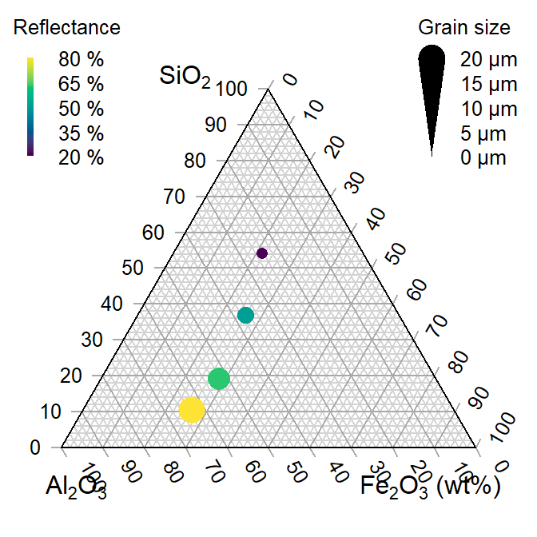

## Overview

Ternary plots provide a way to visualize how three components of compositional data vary and relate to one another. Examples include the proportions of young, working‑age, and elderly populations, or the mix of sand, silt, and clay in soil. The plot takes the form of a triangle scaled from 0 to 1, with each side representing one component; a point's position is determined by drawing perpendiculars to the triangle's sides that intersect at its values.

A quick visualization of a ternary plots shown below taken from https://cran.r-project.org/web/packages/Ternary/vignettes/Ternary.html

 In this section, we'll learn how to create ternary plots to explore and analyze Singapore's population structure.

## Check, install and launch packages

```{r}
pacman::p_load(plotly, ggtern, tidyverse)
```

The packages above are explained below:

1.  **ggtern** package extends ggplot2 to create ternary diagrams, making it ideal for plotting static ternary plots.

2.  **plotly** package enables interactive web‑based graphics through the plotly.js JavaScript library. Its ggplotly() function can convert ggplot2 figures into interactive plotly objects.

3.  **tidyverse** package to support data handling and preparation specifically readr, dplyr and tidyr.

## Data Preparation

### Importing Data

```{r}
pop_data <- read_csv("../data/respopagsex2000to2018_tidy.csv", show_col_types = FALSE)
```

We will use the DT library to show the table as an interactive html

```{r, echo = FALSE}
library(DT)
datatable(pop_data)
```

It consists 5 columns and 10813 rows.

### Feature Engineering

We will use the `mutate()` function from `dplyr` package to derive three new variables explained below

```{r}
agpop_mutated <- pop_data %>%
  mutate(`Year` = as.character(Year))%>%
  spread(AG, Population) %>%
  mutate(YOUNG = rowSums(.[4:8]))%>%
  mutate(ACTIVE = rowSums(.[9:16]))  %>%
  mutate(OLD = rowSums(.[17:21])) %>%
  mutate(TOTAL = rowSums(.[22:24])) %>%
  filter(Year == 2018)%>%
  filter(TOTAL > 0)
```

## Plotting Ternary Plot

### Plotting a static ternary diagram

We will use `ggtern()` function of ggtern package to create the simplest ternary plot.

::: panel-tabset
### Without title

```{r}
ggtern(data=agpop_mutated, 
       aes(x=YOUNG, y= ACTIVE, z=OLD)) +
  geom_point()
```

### With title

```{r}
ggtern(data=agpop_mutated, 
       aes(x=YOUNG, y= ACTIVE, z=OLD)) +
  geom_point() +
  labs(title="Population structure, 2015") +
  theme_rgbw()
```
:::

## Plotting Interactive Ternary Plot

We will incorporate `plot_ly()` function to improve our static plot into an interactive one

:::panel-tabset

### The plot

```{r, echo=FALSE}
# reusable function to create object annotation
label <- function(txt) {
  list(
    text = txt,
    x=0.1, y=1, 
    ax=0, ay=0,
    xref="paper", yref="paper",
    align="center",
    font=list(family="serif", size=15, color="white"),
    bgcolor="#b3b3b3", bordercolor="black", borderwidth=2
  )
}

# reusable function to format axis
axis <- function(txt) {
  list(
    title=txt, tickformat=".0%", tickfont=list(size=10)
  )
}

ternaryAxes <- list(
  aaxis = axis("Young"),
  baxis = axis("Active"),
  caxis = axis("Old")
)

# initiating a plotly visualization
plot_ly(
  agpop_mutated,
  a = ~YOUNG,
  b = ~ACTIVE,
  c = ~OLD,
  color = I("black"),
  type = "scatterternary"
) %>%
  layout(
    annotations = list(
      list(
        text = "Ternary Markers",
        showarrow = FALSE
      )
    ),
    ternary = list(
      aaxis = list(title = "Young"),
      baxis = list(title = "Active"),
      caxis = list(title = "Old")
    )
  )
```

### The code chunk

``` r
# reusable function to create object annotation
label <- function(txt) {
  list(
    text = txt,
    x=0.1, y=1, 
    ax=0, ay=0,
    xref="paper", yref="paper",
    align="center",
    font=list(family="serif", size=15, color="white"),
    bgcolor="#b3b3b3", bordercolor="black", borderwidth=2
  )
}

# reusable function to format axis
axis <- function(txt) {
  list(
    title=txt, tickformat=".0%", tickfont=list(size=10)
  )
}

ternaryAxes <- list(
  aaxis = axis("Young"),
  baxis = axis("Active"),
  caxis = axis("Old")
)

# initiating a plotly visualization
plot_ly(
  agpop_mutated,
  a = ~YOUNG,
  b = ~ACTIVE,
  c = ~OLD,
  color = I("black"),
  type = "scatterternary"
) %>%
  layout(
    annotations = list(
      list(
        text = "Ternary Markers",
        showarrow = FALSE
      )
    ),
    ternary = list(
      aaxis = list(title = "Young"),
      baxis = list(title = "Active"),
      caxis = list(title = "Old")
    )
  )
```
