## Table of Contents
Do take note that the slides are scrollable to see plot insights

| Slide | Section |
|---|---|
| 1 | Cover |
| 2 | Contents |
| 3 | Study Overview |
| 4 | Portfolio Snapshot & Temporal Growth |
| 5 | Portfolio Composition: Policy, Bonus & Geography |
| 6 | Driver Age & Vehicle Age Distributions |
| 7 | Claim Severity & Premium Distributions |
| 8 | Loss Ratio by Policy Type |
| 9 | Claim Frequency by Driver Age Band |
| 10 | Bonus Score: Claim Frequency & Pure Premium |
| 11 | Geographic Risk Drivers |
| 12 | Vehicle Age vs Claim Severity |
| 13 | Temporal Trends & Correlation Matrix |
| 14 | Loss Ratio Heatmap & Treemap |
| 15 | Key Risk Flags & Conclusion |

::: {.notes}
This executive summary follows the same analytical flow as the main report. From portfolio structure, univariate visualization, bivariate statistical validation, to bonus analysis. Slides 3 to 7 cover univariate exploration across numerical and categorical dimensions. Slides 8 to 14 present bivariate and multivariate findings with statistical confirmation. Slide 15 contains summary and actionable recommendations drawn directly from the visual analytics findings.
:::

---

## Study Overview

::: columns
::: {.column width="52%"}
**Dataset**
354,140 policy-year observations from a Spanish non-life insurer (2022–2024), 47 variables across four variable groups: Policy characteristics, Driver & Vehicle attributes, Premiums, and Claims & Exposure.

**Research Questions**

1. How are key portfolio variables distributed across numerical and categorical dimensions?
2. Which factors are statistically associated with higher claim frequency, loss severity, or loss ratio?
:::
::: {.column width="48%"}
**Derived Actuarial KPIs**

::: {.kpi}
**Loss Ratio** = Total Incurred ÷ Total Premium
:::
::: {.kpi}
**Claim Frequency** = Total Claims ÷ Total Exposure
:::
::: {.kpi}
**Claim Severity** = Total Incurred ÷ Total Claims *(claim-active policies only)*
:::
::: {.kpi}
**Pure Premium** = Total Incurred ÷ Total Exposure
:::
:::
:::

::: {.notes}
The study applies tidyverse-based data wrangling and ggplot2-based visual analytics to a real-world motor insurance dataset. Four derived KPIs underpin all analyses. Loss ratio measures overall profitability. Claim frequency captures how often losses occur per unit of exposure. Claim severity measures cost per incident. Pure premium combines both into the pricing base rate. Note that claim_severity carries ~86% missing values by construction (zero-claim policies), not data quality failure.
::: 

---

## Portfolio Snapshot & Temporal Growth

::: columns
::: {.column width="50%"}
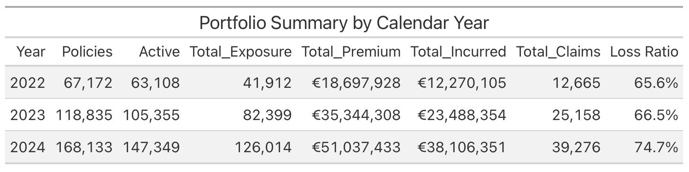{height="260px"}
:::
:::{.column width="50%"}
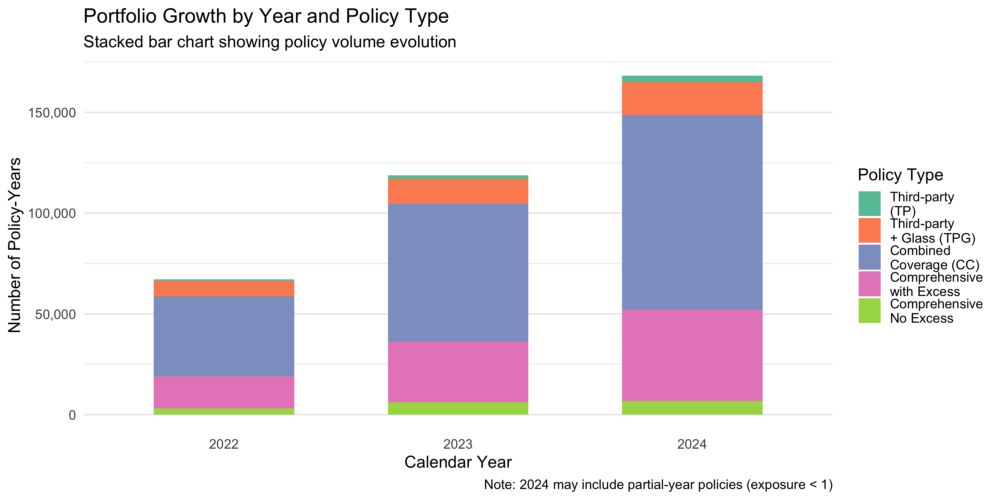{height="260px"}
:::
:::

::: {.desc}
Portfolio grew 150% from 2022 to 2024. Combined Coverage (CC) is the dominant product throughout. Loss ratio remains below break-even but trends upward, pricing sustainability warrants close monitoring.
:::

::: {.notes}
The portfolio experienced a 150% increase from 2022 to 2024, primarily driven by growth in Combined Coverage policies. Despite this scale-up, the aggregate loss ratio remains below 100% each year, indicating overall solvency. However, the upward trend in loss ratio signals that claims costs are rising faster than premiums. The stacked bar confirms CC dominates throughout, Comprehensive with Excess and Third-party + Glass contribute consistent but smaller shares. Rapid growth introduces cohort maturation risk meaning new business claims patterns typically deteriorate as policies age, and loss ratios in 2025 may worsen as 2024 cohorts develop.
:::

---

## Portfolio Composition: Policy, Bonus & Geography

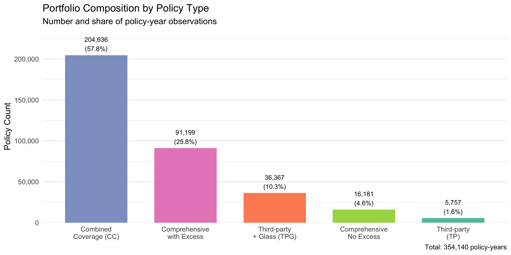 
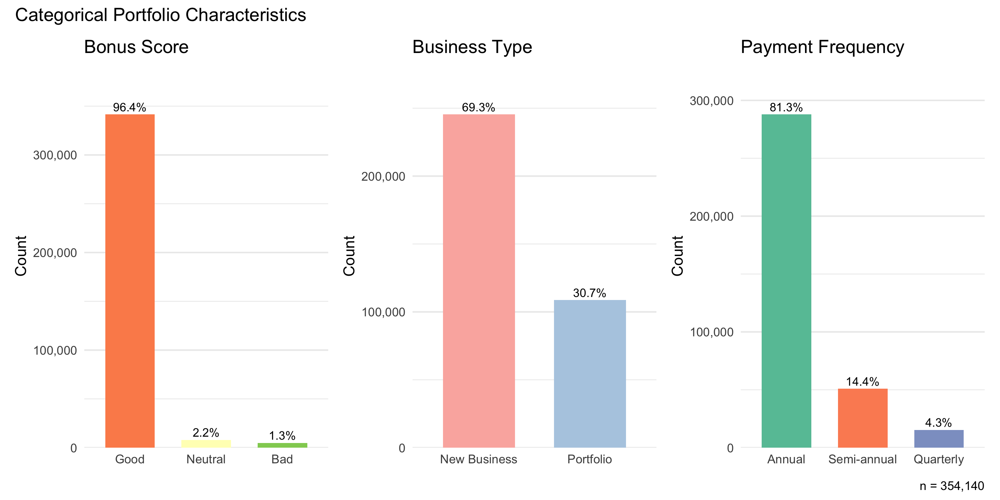
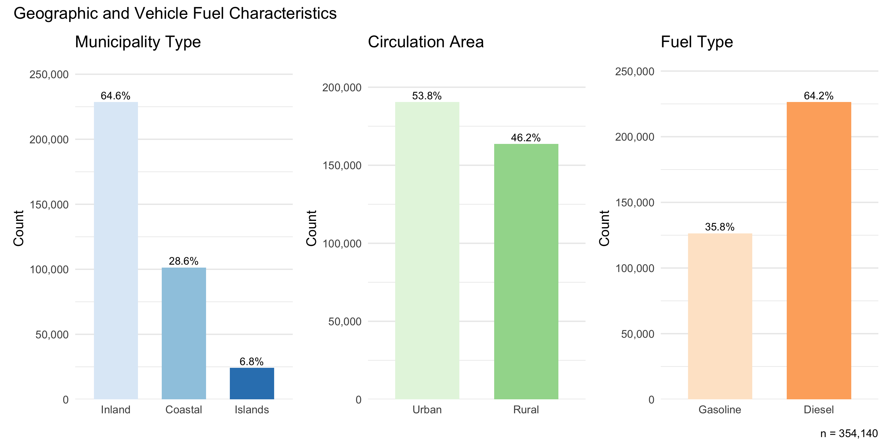

::: {.desc}
CC dominates policy mix. Over 90% of policyholders hold a "Good" bonus score, reflecting the insurer's underwriting selectivity. Portfolio is predominantly inland and urban, indicating concentrated traffic-related risk.
:::

::: {.notes}
Combined Coverage is the dominant policy type, followed by Comprehensive with Excess and Third-party. The bonus score distribution is heavily skewed toward "Good" meaning the insurer has successfully filtered out high-risk policyholders through pricing or cancellation. This creates a structurally low-risk book on the bonus dimension, but it also means bad-bonus policyholders, though few, carry disproportionate tail risk. Geographic concentration in inland and urban areas aligns with Spain's major population centres (Madrid, Zaragoza, Seville), embedding material urban traffic frequency risk across the majority of policies.
:::

---

## Driver Age & Vehicle Age Distributions

::: columns
::: {.column width="50%"}
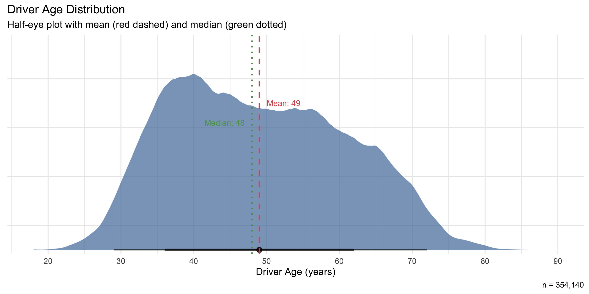{height="380px"}
:::
::: {.column width="50%"}
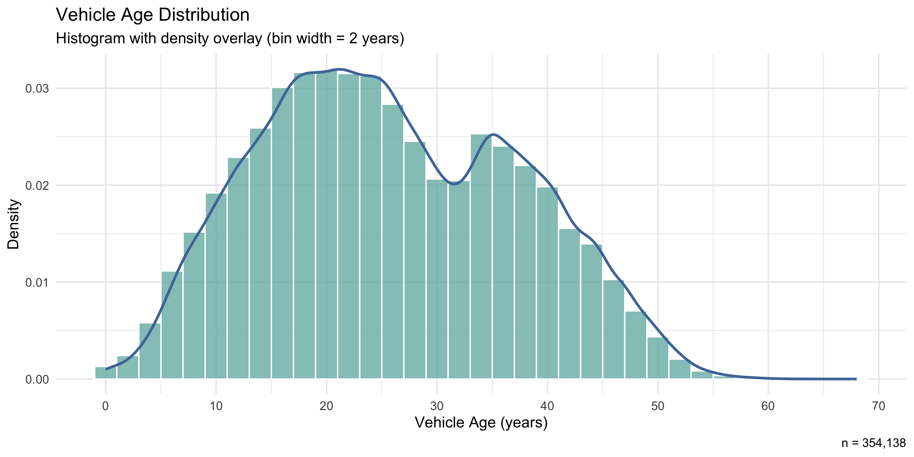{height="380px"}
:::
:::

::: {.desc}
Driver age centres at approximately 49 years with a thin young-driver tail. Vehicle age spreads uniformly from 0 to 68 years, with a long tail of older vehicles that may present mechanical and valuation risk.
:::

::: {.notes}
Driver age follows a near-normal distribution centred around 49 years, with mean and median closely aligned. The thin tail of young drivers (18–25) indicates that while the portfolio has limited exposure to inexperienced drivers, those that exist are concentrated and high-risk. Vehicle age spans 0 to 68 years with a stable age between 10 and 40 years. The long right tail of very old vehicles raises concerns around mechanical reliability and lower residual insured values, both of which affect claim severity modelling. Together, these profiles describe a mature, experienced driver base operating a diverse-age vehicle fleet.
:::

---

## Claim Severity & Total Premium Distributions

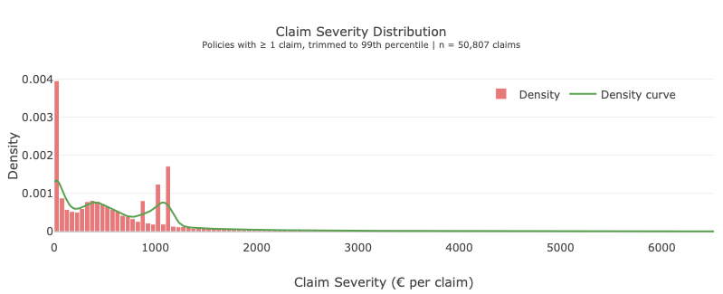

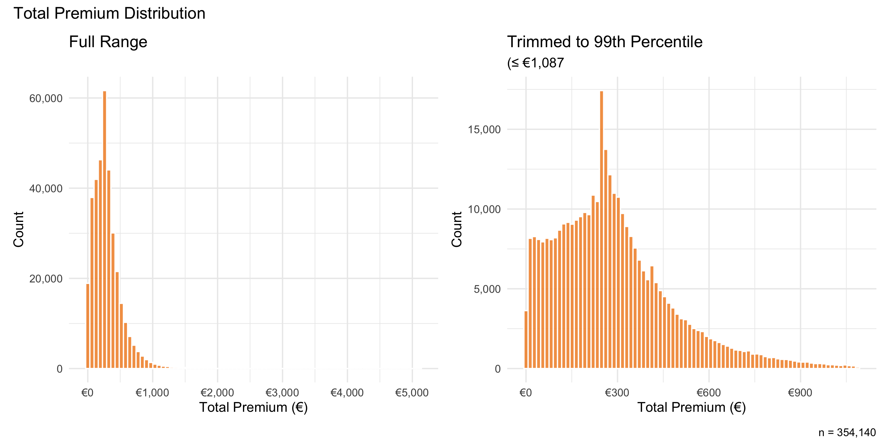

::: {.desc}
Both distributions are strongly right-skewed. Claim severity clusters below €5,000 with a heavy right tail. Total premium is similarly skewed, reflecting the range from basic TP to comprehensive coverage.
:::

::: {.notes}
Claim severity is restricted to claim-active policies (had_claim == TRUE) to avoid zero-inflation distorting the shape. The right-skewed distribution confirms that mean severity substantially exceeds median, meaning pricing models relying on averages will underestimate tail risk. The long tail reflects serious liability losses and total vehicle write-offs. The premium distribution shows a similar skew: most policies generate premiums below €1,000, but a long tail of high-value comprehensive policies creates heterogeneity. This skew is typical in commercial motor books where high-risk or high-value vehicles attract disproportionately higher premiums.
:::

---

## Loss Ratio by Policy Type

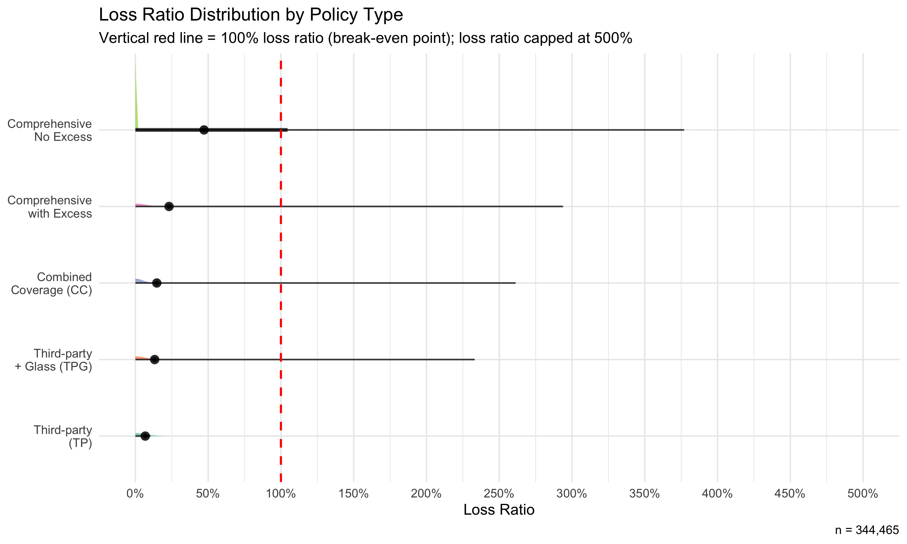
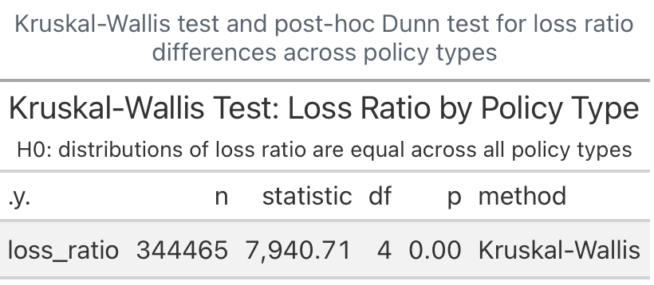
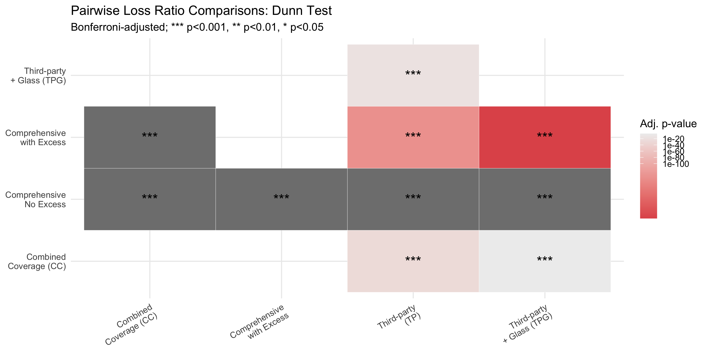

::: {.desc}
Kruskal-Wallis confirms loss ratios differ significantly across all policy types (p < 0.001). Comprehensive No Excess spreads well past 100%. Third-party policies cluster low and stable. Nearly all pairwise contrasts are statistically significant (***).
:::

::: {.notes}
The half-eye plots show the full distributional shape. Comprehensive No Excess has the widest, most right-skewed distribution, indicating high individual policy volatility in addition to elevated average loss ratios. The Dunn post-hoc heatmap shows that almost every policy type pair is statistically significant at p < 0.001, confirming that product design is the single strongest structural predictor of profitability. 
:::

---

## Claim Frequency by Driver Age Band

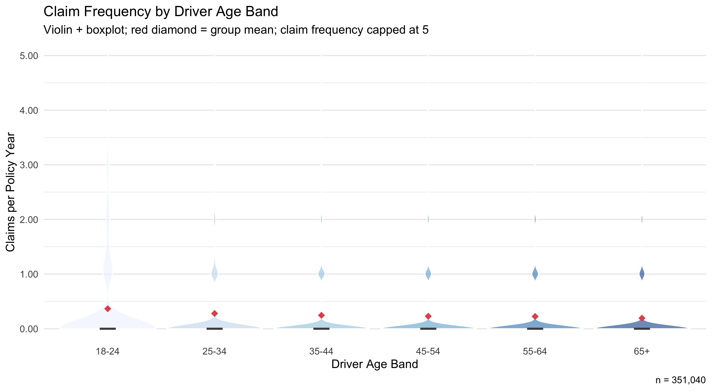
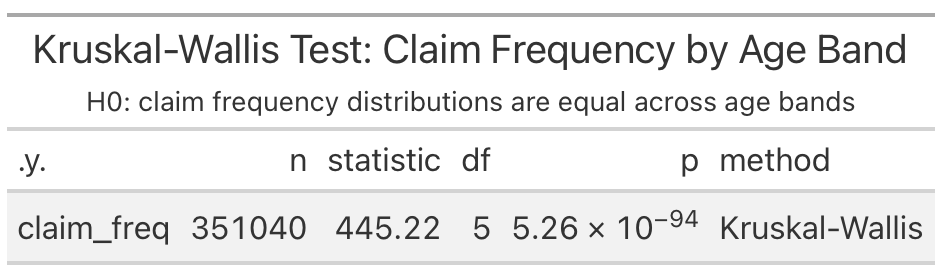

::: {.desc}
Claim frequency follows a U-shaped pattern which highest is among the 18–24 band, declining steadily through 45–64 (the most stable segment). This descriptive insight is statistically confirmed by Kruskal-Wallis (p < 0.001).
:::

::: {.notes}
The violin plot reveals full distributional shape beyond what a boxplot alone would show, the 18–24 group has the widest violin and highest mean. The gradual decline from 25 to 64 represents the portfolio's core profitable segment. The slight 65+ uptick is associated with age-related cognitive and physical decline. The U-shaped pattern directly justifies age-based premium loadings at both ends of the age spectrum. This finding also interacts with the heatmap on slide 14 giving information that young drivers are not unprofitable in every policy type, only in certain coverage tiers.
:::

---

## Bonus Score: Claim Frequency & Pure Premium

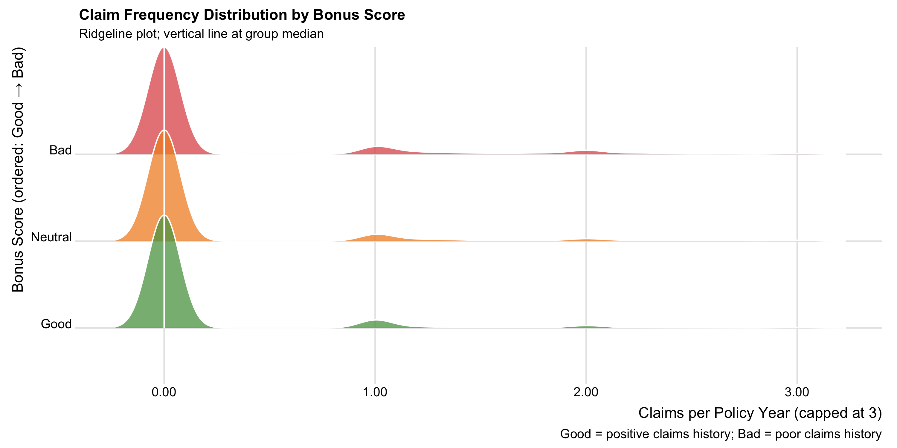
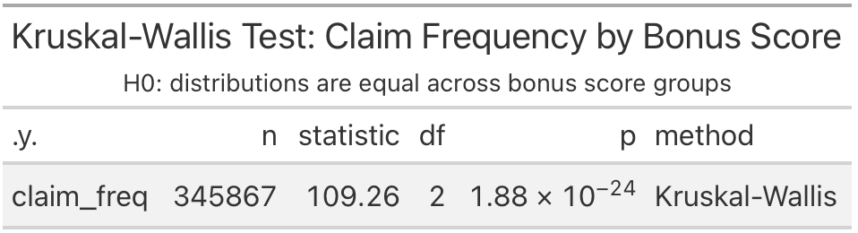
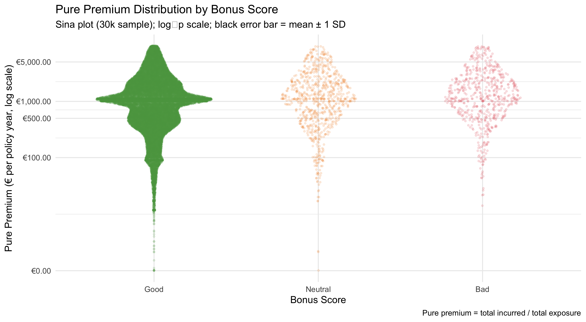

::: {.desc}
"Bad" bonus policyholders show materially higher claim frequencies and a fatter pure premium tail. Even "Neutral" carries more risk than "Good". The sina plot on a log scale reveals the full distributional structure.
:::

::: {.notes}
"Bad" bonus policyholders have a long right tail in claim frequency, meaning rare but high-frequency events are disproportionate in this group. The Kruskal-Wallis test confirms differences are statistically significant. The sina plot shows the "Bad" group not only has a higher mean but also a much fatter right tail, confirming that this group is the primary source of portfolio-level volatility. Both charts together validate the bonus-malus system as an actuarially justified rating tool.
:::

---

## Geographic Risk Drivers

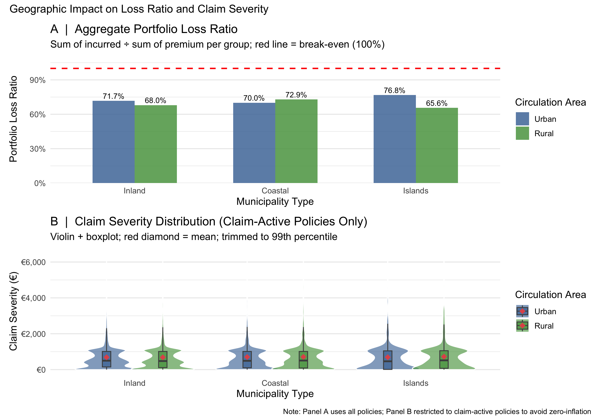

::: {.desc}
Urban areas consistently show higher aggregate loss ratios (Panel A), but claim severity distributions overlap substantially between urban and rural (Panel B). The urban loss ratio premium is driven by frequency, not cost. 
:::

::: {.notes}
Panel A uses all policies, while Panel B restricts to claim-active policies to show severity distribution shape without structural zeros collapsing the IQR. The key diagnostic insight is the separation between frequency and severity effects. Moreover, the Wilcoxon test confirms urban loss ratios are significantly higher (p < 0.001), but Panel B shows severity distributions are nearly identical between urban and rural. This means territorial rating adjustments should be applied to the frequency component of pricing, not to severity loadings. Island policies show above average loss ratios across both panels, likely reflecting limited repair infrastructure and distinct weather exposure.
:::

---

## Vehicle Age vs Claim Severity

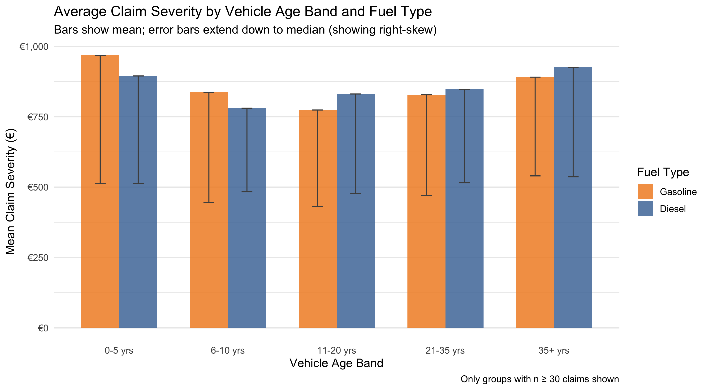

::: {.desc}
Newer vehicles (0–5 yrs) attract the highest mean claim severity across both fuel types meaning higher replacement costs. Severity falls sharply with vehicle age. 
:::

::: {.notes}
The bar height shows mean severity and the gap between bar top and error bar bottom represents the gap between mean and median. Newer vehicles have the highest severity because they carry higher insured values and more expensive parts. The sharp decline from 0–5 years to older bands reflects the depreciation curve. Diesel vehicles show slightly higher severity across all age bands, consistent with their generally higher purchase price relative to equivalent gasoline models. These findings support vehicle age and fuel type as components of severity-side pricing models, distinct from frequency factors.
:::

---

## Temporal Trends & Correlation Matrix

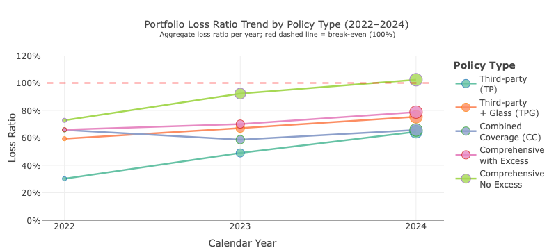

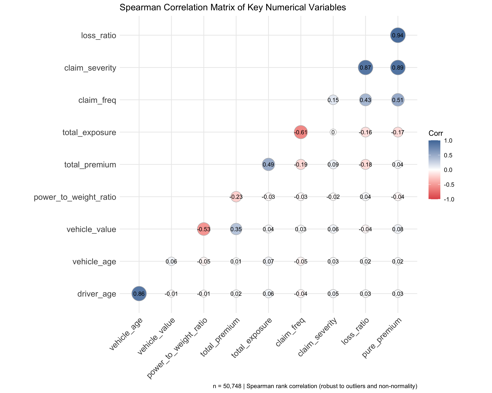

::: {.desc}
COMP_N approach break-even in 2024, with upward trending loss ratios. The correlation matrix confirms claim severity, loss ratio and pure premium are strongly linked and critically, claim frequency and severity are near-zero correlated, validating frequency-severity model independence.
:::

::: {.notes}
The interactive trend chart shows that Third-party policies maintain stable, low loss ratios across all three years, while Comprehensive No Excess shows the most volatile upward trajectory.  The upward trend may reflect claims inflation as repair costs rise faster than premium adjustments, or portfolio quality deterioration from rapid growth. T
:::

---

## Loss Ratio Heatmap & Premium Treemap

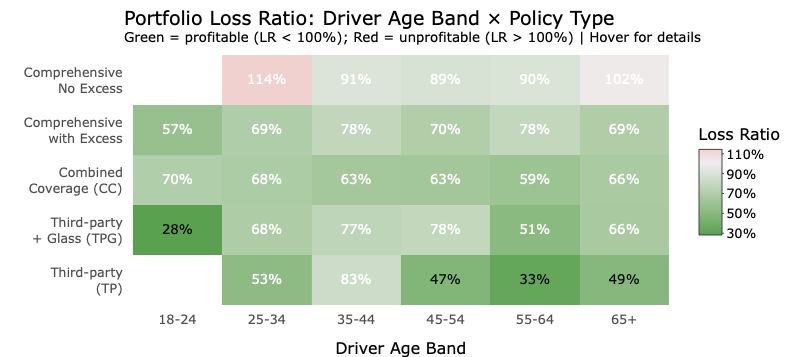
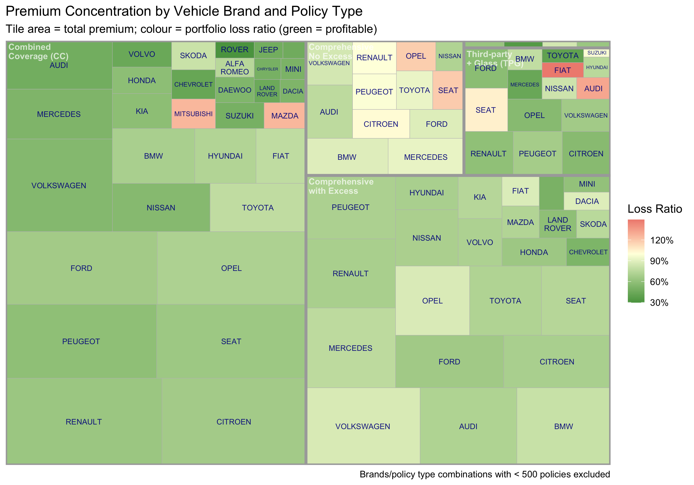

::: {.desc}
25-34 Age Band + Comprehensive No Excess = 114% loss ratio which is the portfolio's most unprofitable cell. The same age group under TPG = 28%, highly profitable. Mercedes, BMW and Audi dominate premium share, COMP_N tiers for luxury brands show elevated loss ratios.
:::

::: {.notes}
The interactive heatmap reveals interaction effects invisible to univariate analysis. Young drivers are not uniformly unprofitable, under Third-party + Glass they are the most profitable age group. The 114% loss ratio in 25-34 × COMP_N is the portfolio's single most actionable pricing gap and warrants immediate review. Even if certain brand × policy combinations are unprofitable, their contribution to total premium determines the financial materiality. Mercedes, VW and BMW dominate premium share, so their COMP_N loss ratios carry significant portfolio-level impact.
:::

---

## Key Risk Flags & Conclusion

::: columns
::: {.column width="50%"}
**Six Validated Findings**

::: {.kpi}
**1. Policy type** is the strongest profitability predictor (KW p < 0.001)
:::
::: {.kpi}
**2. Bonus score** reliably predicts claim frequency, validates bonus-malus system
:::
::: {.kpi}
**3. Driver age** creates a U-shaped risk curve, 18–24 and 65+ are elevated
:::
::: {.kpi}
**4. Geography = frequency, not severity** — urban areas have more accidents, not costlier ones
:::
::: {.kpi}
**5. Frequency & Severity** — empirically validates frequency-severity model independence
:::
::: {.kpi}
**6. New vehicles cost most** — severity declines sharply with vehicle age
:::
:::
::: {.column width="50%"}
**Recommendation**

::: {.kpi .red}
🔴 **25–34 × COMP_N: LR ≈ 114%** — re-price with age loading or restructure excess
:::
::: {.kpi .red}
🔴 **Urban frequency gap** — apply territorial frequency surcharge
:::
::: {.kpi .red}
🔴 **150% growth 2022–2024** — monitor 2024 cohort quarterly as claims mature
:::
::: {.kpi .amber}
🟡 **Luxury brand COMP_N** — repair cost inflation may outpace premium adjustments
:::
::: {.kpi .green}
🟢 **TP & TPG** — stable, profitable segments can protect and grow
:::
:::
:::

::: {.notes}
Six findings are statistically validated and directly actionable. The most urgent is the 25–34 × Comprehensive No Excess pricing gap at 114% loss ratio which requires either a premium age-loading or an excess restructure to bring it toward break-even. Urban frequency surcharges should be applied to the frequency component of territorial rating factors, not severity loadings. The 2024 growth cohort requires quarterly monitoring as claims develop. 
:::
